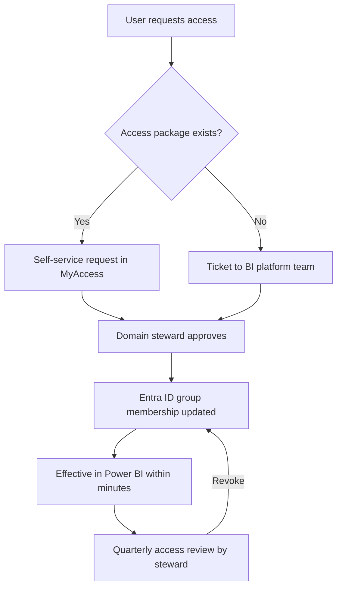
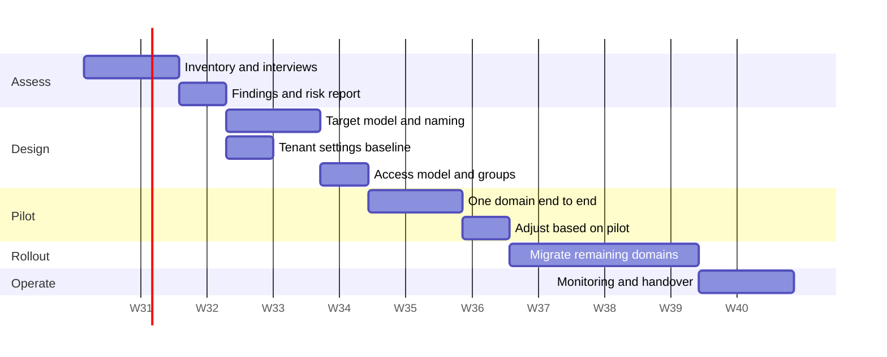

# Power BI administration framework — options, plan and feasibility

Version 0.1 — discussion draft. Assumptions marked `[VERIFY]` must be confirmed with the customer before this becomes a commitment.

---

## 1. What the customer actually asked for

Three questions were raised: user access management, workspace organization, and access levels inside workspaces. These are not three separate problems. They are three views of one thing: **an operating model for the platform**.

The dependency runs in one direction:

```
Licensing & capacity  →  Workspace structure  →  Roles inside workspaces  →  Access provisioning
      (what you can       (where content         (what people can            (how people get
       afford / enable)    lives)                 do there)                   in and out)
```

Deciding access levels before deciding workspace structure produces rework. The plan below follows the dependency order.

---

## 2. Baseline facts you need before designing anything

Do not design in a vacuum. Phase 0 is an inventory. These are the questions that change the answer:

| # | Question | Why it changes the design |
|---|---|---|
| 1 | Which licenses exist today: Pro, PPU, or a Fabric capacity (F SKU)? | F64 and above lets free-license users consume content. Below that, every viewer needs Pro. This alone reshapes the workspace and app strategy. |
| 2 | How many workspaces exist, and how many have a named owner? | Orphaned workspaces are the most common finding and the biggest cleanup cost. |
| 3 | Is Microsoft Entra ID group management delegated to IT, or can the BI team create groups? | If the BI team cannot create groups, the whole access model has to run through a ticket process. |
| 4 | Is there an existing tenant-settings configuration, and who is Fabric Administrator today? | Global Administrators acting as BI admins is a finding, not a design input. |
| 5 | Are Fabric items (lakehouses, notebooks, pipelines) in scope, or Power BI only? | Fabric item creation can be controlled separately from Power BI. Scope creep risk. |
| 6 | Is there any data classification / sensitivity labeling requirement? | Purview integration is a separate workstream if yes. |
| 7 | Are there external users (partners, contractors) consuming reports? | External sharing settings and B2B guest handling become a design constraint. |
| 8 | Is there a regulatory constraint (data residency, audit retention)? | Drives audit log export and capacity region choices. |

**How to collect this** — three sources, in this order:

1. **Admin portal**: tenant settings screen, workspaces list, capacity settings.
2. **Fabric / Power BI REST APIs**: the admin scanner API (`getInfo`) returns a full metadata dump of workspaces, semantic models, reports, and permissions. This is the only realistic way to inventory a tenant with more than ~50 workspaces.
3. **Activity log**: 30 days of activity events give real usage — who publishes, who views, what is dead. Export to storage if you need more than 30 days.

If REST API access is not granted in week 1, the whole timeline slips. Flag this as the top dependency.

---

## 3. Design decision A — workspace organization

### The four viable patterns

| Pattern | Structure | Fits when | Weakness |
|---|---|---|---|
| **A. By business domain** | One workspace per domain: Finance, Sales, Ops, HR | Small-to-medium orgs, single BI team, few reports | No dev/prod separation; everything is production |
| **B. Domain + lifecycle** | `Finance-DEV` / `Finance-TEST` / `Finance-PROD` per domain, wired to a deployment pipeline | Regulated or change-controlled environments | 3× workspace count; needs discipline and a release process |
| **C. Hub and spoke** | Central *data* workspaces hold certified semantic models; *report* workspaces consume them via shared datasets | Multiple report authors reusing the same models | Requires Build permission governance and a certification process |
| **D. By project or team** | One workspace per initiative | Consulting / project-driven organizations | Degenerates into sprawl fastest; hardest to certify |

### Recommended default

**C + B combined, scoped by governance tier.** Concretely:

- Separate the **data layer** from the **report layer**. Semantic models live in domain data workspaces owned by the BI team. Reports live in domain report workspaces owned by the business.
- Apply **Dev/Test/Prod only to content classified as critical**. Applying it to everything is the most common cause of a governance program stalling.
- Introduce a **third tier: sandbox / self-service**, explicitly ungoverned, with a stated expiry policy. If you do not give self-service a legitimate home, it colonizes production.
- Group workspaces under **Fabric Domains** (Finance, Commercial, Supply Chain) so domain-level settings and delegated admin become possible later.

### Governance tiers

| Tier | Naming | Deployment pipeline | Certification | Owner |
|---|---|---|---|---|
| Certified / critical | `PROD-<Domain>-Data`, `PROD-<Domain>-Rpt` | Required | Required | BI team + domain steward |
| Managed self-service | `<Domain>-Team-<Name>` | Optional | Promoted only | Business owner |
| Sandbox | `SBX-<User or Team>` | No | No | Creator, 90-day review |

**Naming convention** — pick one and enforce it via the workspace request process:
`<Tier>-<Domain>-<Purpose>` → `PROD-FIN-Data`, `PROD-FIN-Rpt`, `SBX-Commercial-Pricing`.

Naming is not cosmetic. It is what makes the monthly audit script possible.

---

## 4. Design decision B — access levels inside workspaces

Power BI workspace roles are fixed. The design work is mapping personas onto them, not inventing new ones.

| Role | Can do | Assign to |
|---|---|---|
| **Admin** | Everything, including adding/removing users and deleting the workspace | 2 named people maximum per workspace: BI platform team + one business backup |
| **Member** | Publish, share, add others up to Member level | Domain steward, senior analyst |
| **Contributor** | Create and edit content; cannot share externally or manage access | Report developers |
| **Viewer** | Read published content, respects row-level security | Nobody, in the recommended model — see below |

### The important nuance

**Do not use the Viewer role as the consumption channel.** Use **Power BI Apps** with audiences instead. Reasons:

- Apps give a curated experience; workspace access exposes work-in-progress content.
- App audiences let you serve different report subsets to different groups from one workspace.
- Removing someone from an app audience is a one-line change; auditing dozens of Viewer assignments is not.

Reserve the Viewer role for genuine exceptions where someone needs access to a raw item.

### Row-level security interacts with roles

RLS is only enforced for Viewers and app consumers. Members and Contributors bypass it. If a domain has confidentiality requirements, the number of Contributors is a security decision, not a convenience decision.

---

## 5. Design decision C — how access is granted

### Options

| Option | Mechanism | Verdict |
|---|---|---|
| Individual user assignment | Add people directly to workspaces | Reject. Unauditable and unmaintainable past ~20 users. |
| Entra ID security groups | One group per workspace-role pair, workspaces reference groups only | **Recommended.** |
| Entra ID + access packages (Entitlement Management) | Self-service request with approval workflow and expiry | Best end state; requires Entra ID P2 licensing `[VERIFY]` |
| Privileged Identity Management for admins | Just-in-time elevation to Fabric Administrator | Recommended for the tenant-admin role only |

### Recommended group naming

```
PBI-<Domain>-<Tier>-<Role>

PBI-FIN-PROD-Admin
PBI-FIN-PROD-Member
PBI-FIN-PROD-Contributor
PBI-FIN-APP-Consumers
```

One rule: **a workspace never contains a person, only a group.** This makes the access review a group-membership review, which HR and IT already know how to run.

### Request-to-access flow



---

## 6. Design decision D — tenant settings baseline

Tenant settings are the guardrails. A minimum defensible baseline:

| Setting | Recommended | Rationale |
|---|---|---|
| Create workspaces | Restricted to a `PBI-Workspace-Creators` group | The single highest-impact anti-sprawl control |
| Publish to web | Disabled for the entire organization | Creates anonymous public URLs. No legitimate internal use case. |
| Export data / Export to Excel | Restricted to specific groups | Bulk exfiltration path |
| External sharing | Restricted, guest users limited | |
| Publish apps to entire organization | Restricted group | |
| Certification | Enabled, certifier group defined | Required for the endorsement model to work |
| Usage metrics for content creators | Enabled | Needed for adoption KPIs |
| Service principals can use APIs | Enabled for a dedicated monitoring service principal | Required for automated inventory |
| Fabric item creation | Separately controlled `[VERIFY scope]` | Lets you govern Power BI without blocking or opening Fabric |

**Change control:** every tenant-setting change gets a record — what changed, who approved, business justification. This is the artifact an auditor will ask for.

---

## 7. Roles and responsibilities

| Role | Responsibility | Headcount |
|---|---|---|
| Fabric / Power BI Service Administrator | Tenant settings, capacity, gateways | 2 named people (never Global Admins) |
| Capacity administrator | Capacity assignment, throttling monitoring | 1–2 |
| Domain steward | Certifies models, approves access, owns the semantic layer for the domain | 1 per domain |
| Workspace owner | Accountable for content and lifecycle in one workspace | 1 named person per production workspace |
| Content creator | Builds reports and models within the guardrails | Many |
| Consumer | Uses apps | Many |

The role that gets skipped and shouldn't: **workspace owner**. A workspace without a named individual owner is by definition ungoverned.

---

## 8. Execution plan



| Phase | Duration | Output | Difficulty |
|---|---|---|---|
| **0. Assess** | 2–3 weeks | Inventory, findings, risk register, current-state diagram | Low technically. Blocked by access. |
| **1. Design** | 2–3 weeks | Governance framework document, workspace map, group naming standard, tenant-settings baseline, RACI | Low–medium. Mostly decisions, not build. |
| **2. Pilot** | 2 weeks | One domain fully restructured and migrated | Medium |
| **3. Rollout** | 4–8 weeks | All domains migrated, apps published, old workspaces archived | **Medium–high — this is where projects die** |
| **4. Operate** | Ongoing | Monitoring dashboard, quarterly access review, runbook | Low |

**Total: 10–16 weeks** for a mid-sized tenant (roughly 50–200 workspaces, 300–1500 users). Under 30 workspaces, compress to 6–8 weeks.

### Resources

| Resource | Effort |
|---|---|
| BI governance lead (this role) | 60–80% for phases 0–2, 40% for phase 3 |
| Power BI / Fabric administrator | 20–30% throughout — must have admin portal access |
| Entra ID administrator | 10% — group creation, access packages |
| Domain stewards | 4–6 hours each in design, 1 day each during migration |
| Executive sponsor | Decision authority at two gates: after Design, after Pilot |

### Estimated cost drivers to flag

- Fabric capacity SKU change, if moving to F64+ to enable free-license viewers.
- Entra ID P2, if access packages are wanted.
- No tooling purchase is strictly required. Inventory can be built with the REST APIs and a Power BI report.

---

## 9. Feasibility and risk

**Technical difficulty: low.** Nothing here is hard to configure. Workspace roles, groups, tenant settings, and deployment pipelines are all native, documented features.

**Organizational difficulty: high.** This is the honest assessment and it should go in the customer deck. The failure modes are:

| Risk | Likelihood | Impact | Mitigation |
|---|---|---|---|
| No named owners for existing workspaces | High | High | Time-boxed claim period, then archive unclaimed workspaces (with a restore window) |
| Users lose access to something during migration | High | Medium | Run old and new in parallel for 2 weeks; never delete, archive |
| Restricting workspace creation is seen as a blocker | High | Medium | Ship the sandbox tier and a fast (<48h) workspace request SLA at the same time |
| Admin portal access not granted in time | Medium | High | Escalate in week 1; the project cannot start without it |
| Scope creeps into full Fabric governance | Medium | Medium | Explicitly bound the scope to Power BI in the SOW |
| Licensing surprises | Medium | High | Confirm license model in phase 0, not phase 3 |

**Viability: high, conditional on two things** — a named executive sponsor, and admin-level tenant access. Without either, deliver the design document and stop; do not attempt rollout.

---

## 10. Expected results

Concrete, measurable outcomes to commit to:

| Metric | Target |
|---|---|
| Production workspaces with a named owner | 100% |
| Workspaces created outside the request process | 0 per quarter |
| Access granted via group rather than individual | >95% |
| Critical semantic models certified | 100% |
| "Publish to web" reports in the tenant | 0 |
| Time to grant access to an existing workspace | <48 hours |
| Duplicate semantic models covering the same subject | Reduce by a stated % from baseline |

Deliverable artifacts:

1. Current-state assessment and risk register
2. Governance framework document (this document, expanded and customer-specific)
3. Workspace map and naming standard
4. Entra ID group catalog and provisioning process
5. Tenant settings baseline with change log
6. RACI matrix
7. Migration runbook
8. Monitoring report (adoption, capacity, access, orphaned content)
9. Administrator handover and training session

---

## 11. Open questions for the customer

1. Current license and capacity model?
2. Who has Fabric Administrator today, and will this engagement get admin access?
3. Is Fabric (beyond Power BI) in scope?
4. Are sensitivity labels / Purview required?
5. Approximate workspace, report, and user counts?
6. Is there an existing data governance body, or does one need to be created?
7. Is the outcome a design document, or design plus implementation?

Question 7 is the one to settle first — it changes the estimate by a factor of three.
