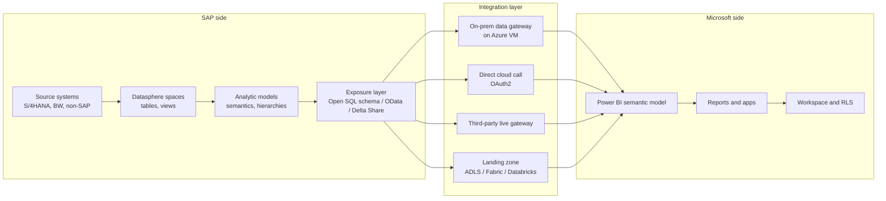
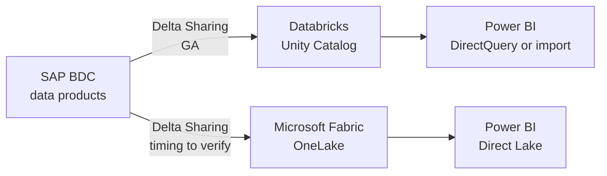
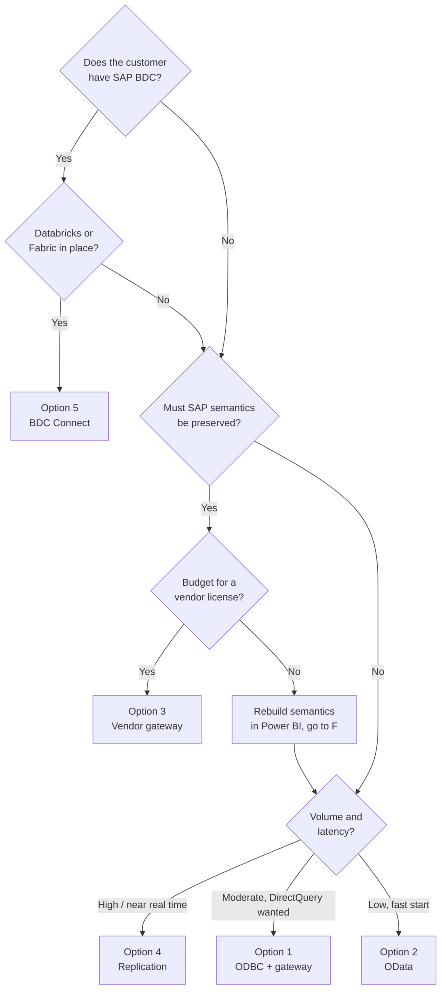
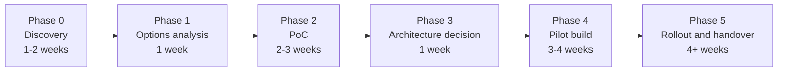

# Connecting Power BI to SAP Datasphere — architecture options and implementation plan

Version 0.1 — discussion draft. Assumptions marked `[VERIFY]` must be confirmed before this becomes a commitment.

---

## 1. Framing the problem correctly

The question "how do we connect Power BI to Datasphere" has five technically valid answers. Choosing between them is not a connectivity question — it is a decision about **where the semantic layer lives and who enforces security**.

Three questions determine the answer. Everything else is detail.

| Question | If answer A | If answer B |
|---|---|---|
| **Where do business semantics live?** (hierarchies, currency conversion, calculated measures) | Datasphere → you need a path that preserves them | Power BI → you can pull flat tables and rebuild |
| **Who enforces row-level security?** | Datasphere (Data Access Controls) → you need per-user identity propagation | Power BI (DAX RLS) → a technical service user is acceptable |
| **What is the data volume and latency requirement?** | Large / near-real-time → federation or replication | Modest / daily → import works fine |

If the customer cannot answer these, the deliverable is a **decision workshop**, not an architecture. Say so.

---

## 2. Reference architecture — the layers involved

The single most important design point sits at the boundary: **an analytic model in Datasphere and a semantic model in Power BI do the same job.** Building both means maintaining business logic twice, and they will diverge. Decide which one is authoritative before writing a line of M code.

---

## 3. The five connectivity options

### Option 1 — Open SQL schema via SAP HANA ODBC

Datasphere exposes a space's objects to a database user. Power BI connects with the SAP HANA ODBC driver (or the generic ODBC connector).

**How it works**
1. In Datasphere: Space Management → Database Access → create a database user with read access.
2. Add the connecting client's public IPv4 address to the Datasphere IP allowlist.
3. Install the SAP HANA client / ODBC driver on the machine that will connect — the developer's desktop for authoring, and the gateway VM for scheduled refresh.
4. Power BI Desktop → Get Data → SAP HANA database or ODBC → Import or DirectQuery.
5. For the Power BI Service, register the gateway data source and bind the semantic model to it.

| Aspect | Assessment |
|---|---|
| Performance | Best of all options. Native SQL pushdown; HANA does the work. |
| DirectQuery | Supported |
| Semantics preserved | **No.** You see the exposed views as flat relational objects. Technical field names, no hierarchies, no analytic-model measures. |
| Security | Connects as a **database user**, not the report viewer. Datasphere sees one identity. RLS must be rebuilt in Power BI DAX, or SSO must be configured. |
| Infrastructure | Gateway VM required for the Service. Static outbound IP required for the allowlist. |
| Operational burden | Medium — driver version management, password rotation policy on the database user, IP allowlist maintenance. |

**The governance objection you will hear:** "that database user can see everything in the space." It is a fair objection. Answers: scope one database user per space with a minimal set of exposed views; or configure SAML/Kerberos SSO through the gateway so Datasphere applies the real user's privileges. SSO is materially harder — plan a week for it, not a day.

---

### Option 2 — OData

Datasphere exposes analytic models or relational views as OData services. Power BI consumes them with the OData or Web connector over OAuth2.

Two flavors:
- **Analytical OData** — consumes an analytic model, preserving aggregation behavior and business semantics.
- **Relational OData** — consumes fact and dimension views as flat entities.

| Aspect | Assessment |
|---|---|
| Performance | Weakest. HTTP pagination; poor for large extracts. |
| DirectQuery | **Not supported** — import only. |
| Semantics preserved | Partially, and better than ODBC when using the analytical flavor. |
| Security | OAuth2 client credentials or authorization code flow. Token refresh in the Power BI Service is the recurring pain point. |
| Infrastructure | **None** — cloud to cloud, no gateway, no driver, no VM. |
| Operational burden | Low to set up, medium to keep running. |

**When this is the right answer:** modest volumes, a small number of curated analytic models, and an organization that does not want to run a gateway VM. It is by far the fastest route to a working proof of concept — use it in week 1 to demonstrate feasibility even if it is not the final architecture.

---

### Option 3 — Third-party live connectivity gateway

Commercial products (APOS Live Data Gateway, CData drivers, Theobald) sit between the two platforms and translate the SAP semantic layer into something Power BI can consume live.

| Aspect | Assessment |
|---|---|
| Performance | Good; live query |
| DirectQuery / Live | Supported |
| Semantics preserved | **Yes — this is the entire value proposition.** Hierarchies, currency conversion, and Datasphere-defined measures survive. |
| Security | Vendor-dependent; most support identity propagation so Datasphere DACs apply per user |
| Infrastructure | Vendor server component to install and operate |
| Operational burden | Medium, plus vendor dependency |
| Cost | License fee `[VERIFY — request quotes]` |

**When this is the right answer:** the customer has invested heavily in Datasphere analytic models and refuses to rebuild that logic in DAX, and per-user security must be enforced by Datasphere. This is the option that solves both hard problems at once, and it is the one procurement will resist.

---

### Option 4 — Replicate out to a Microsoft landing zone

Datasphere replication flows (or a scheduled pull through the Open SQL schema) push data into Azure Data Lake Storage, Azure SQL, a Fabric Lakehouse, or Databricks. Power BI reads from there.

| Aspect | Assessment |
|---|---|
| Performance | Best at scale; refresh is decoupled from SAP |
| Mode | Import, or Direct Lake if landing in Fabric |
| Semantics preserved | No — rebuilt on the Microsoft side |
| Security | Fully Microsoft-side |
| Infrastructure | A full data platform: storage, orchestration, monitoring |
| Operational burden | High — this is a data engineering program, not a connection |
| Cost | Storage and compute, plus Datasphere outbound integration charges `[VERIFY: Premium Outbound Integration blocks]` |

**When this is the right answer:** high volumes, many downstream consumers beyond Power BI, or an existing Fabric/Databricks investment. Given a Databricks-centric stack, this option and option 5 converge.

---

### Option 5 — BDC Connect / Delta Sharing (the strategic path)

SAP Business Data Cloud implements the open Delta Sharing protocol over its object store, allowing zero-copy bidirectional sharing of SAP data products.

Current status:
- **Databricks: generally available since October 2025.**
- **Google BigQuery and Snowflake: first half of 2026.**
- **Microsoft Fabric: announced for Q3 2026 — `[VERIFY current GA status before presenting]`.**

| Aspect | Assessment |
|---|---|
| Performance | Zero-copy federated access; no pipeline latency |
| Semantics preserved | Yes — SAP business context travels with the data product |
| Security | Governed on both sides; Unity Catalog on the Databricks side |
| Infrastructure | Requires **SAP Business Data Cloud**, not plain Datasphere |
| Operational burden | Low once established — click-driven, no ETL code |
| Availability risk | The Fabric path is the one the customer wants and the one whose date is least certain |

**Two routings today:**

If the customer already runs Databricks, the available path today is **BDC → Databricks → Power BI**, which works now and positions them for the native Fabric path when it lands. That is the recommendation worth making in the architecture document, with the caveat that it depends on BDC licensing.

---

## 4. Comparison matrix

| | 1. ODBC | 2. OData | 3. Vendor gateway | 4. Replication | 5. BDC Connect |
|---|---|---|---|---|---|
| Setup effort | Medium | **Low** | Medium | High | Medium |
| Time to first report | 1 week | **2 days** | 2 weeks | 4+ weeks | 3+ weeks |
| Performance at scale | High | Low | High | **Highest** | High |
| DirectQuery / live | Yes | **No** | Yes | Direct Lake | Yes |
| Preserves SAP semantics | No | Partial | **Yes** | No | **Yes** |
| Per-user security in SAP | Only with SSO | Possible | **Yes** | No | Governed |
| Gateway / VM needed | **Yes** | **No** | Yes | Yes | No |
| Additional license cost | No | No | **Yes** | Infra cost | **BDC required** |
| Data duplication | Optional | Yes | **No** | **Yes** | **No** |
| Strategic alignment | Tactical | Tactical | Tactical | Medium | **High** |

### Decision tree

---

## 5. Security design — the part that gets under-designed

This is where these projects fail review. Three models, pick one deliberately:

| Model | How it works | Consequence |
|---|---|---|
| **Technical user + Power BI RLS** | One Datasphere database user; all security expressed in DAX roles | Simplest. Datasphere Data Access Controls are bypassed entirely. Security is duplicated and can drift. |
| **SSO with identity propagation** | SAML or Kerberos through the gateway; Datasphere applies the real user's analytic privileges | Correct. Significantly harder: identity mapping (UPN to Datasphere external identity, case-sensitive), certificate management, encryption must be enabled before establishing SAML SSO on the HANA path. |
| **Vendor gateway with propagation** | Product handles identity pass-through | Correct and easier, at a license cost |

**Recommendation for the document:** state plainly that if the customer's Data Access Controls in Datasphere are load-bearing for compliance, the technical-user model is not acceptable, and the cost of the alternatives should be evaluated up front rather than discovered in UAT.

Additional security items to cover:
- Database user password rotation policy and its effect on unattended refresh
- IP allowlist management and the need for a static outbound IP on the gateway VM
- Where sensitivity labels are applied (Purview on the Microsoft side has no visibility into Datasphere classifications)
- Audit trail: Datasphere logs the database user, Power BI logs the report viewer — correlating them requires deliberate design

---

## 6. Proof of concept plan

Do not choose on paper. Two to three weeks of testing produces evidence the customer can act on.

| Week | Activity | Output |
|---|---|---|
| 1 | Provision access: Datasphere database user, IP allowlist, gateway VM, test analytic model | Working Option 2 (OData) connection — proves feasibility fast |
| 2 | Build the same report on Option 1 (ODBC, import and DirectQuery) | Performance comparison on identical logic |
| 3 | Test the strategic option available to the customer (3, 4, or 5) + security test | Recommendation with measured evidence |

**Use one representative model** for all tests — ideally the largest one the business actually cares about, not a toy table.

### Measure these, and put the numbers in the deck

| Metric | Why |
|---|---|
| Initial load time and row count | Baseline |
| Incremental refresh duration | Determines whether the refresh window is viable |
| DirectQuery visual response time (p50, p95) | The number users will judge you on |
| Hierarchies and currency conversion: preserved or lost | Determines rework effort |
| Datasphere capacity units consumed per refresh | Cost — often the surprise |
| Behavior when a security-relevant user changes | Proves the security model works |

---

## 7. Implementation plan

| Phase | Duration | Deliverable | Difficulty |
|---|---|---|---|
| 0. Discovery | 1–2 weeks | Current-state landscape, requirements, volume and latency profile, security requirements | Low |
| 1. Options analysis | 1 week | This document, customer-specific, with scoring against weighted criteria | Low |
| 2. Proof of concept | 2–3 weeks | Measured comparison of 2–3 options | Medium |
| 3. Architecture decision | 1 week | Signed-off target architecture, ADR log, cost model | Low, high stakes |
| 4. Pilot build | 3–4 weeks | One production-grade model end to end, with security and refresh | Medium–high |
| 5. Rollout | 4+ weeks | Remaining models, monitoring, documentation, handover | Medium |

**Phases 0–3 total: 5–7 weeks.** That is the scope of the current request. Phases 4–5 should be quoted separately.

### Resources and dependencies

| Resource | Role | Availability needed |
|---|---|---|
| Data architect (this role) | Design, PoC, documentation | Full time phases 0–3 |
| SAP Datasphere administrator | Space access, database users, IP allowlist, exposure of test models | **Critical dependency — 20%, but responsive** |
| Power BI / Fabric administrator | Gateway registration, tenant settings, workspace | 10% |
| Azure / infrastructure | Gateway VM, static IP, network rules | 10% in phase 0 only |
| Business SME | Defines the representative model and validates numbers | 4 hours per week during PoC |
| Security / compliance | Reviews the identity model | 2 sessions |

The Datasphere administrator is the single point of failure in this plan. If that person is not assigned by day 3, escalate.

---

## 8. Risks

| Risk | Likelihood | Impact | Mitigation |
|---|---|---|---|
| Datasphere admin unavailable, PoC blocked | High | High | Name the person and secure a time commitment before kickoff |
| Semantic layer duplicated in both platforms | High | High | Decide the authoritative layer in phase 3 and document it as a binding decision |
| Security model rejected in review after the build | Medium | **High** | Bring security into phase 0, not phase 4 |
| Datasphere consumption cost exceeds expectation | Medium | Medium | Measure capacity units in the PoC and model the cost before commitment |
| BDC Connect for Fabric slips its date | Medium | Medium | Do not architect on an unreleased capability; design an interim path that migrates cleanly |
| Gateway VM becomes an unmanaged single point of failure | Medium | Medium | Gateway cluster, monitoring, documented ownership from day 1 |
| DirectQuery performance disappoints in UAT | Medium | Medium | Measure p95 in the PoC on the real model, not a sample |

**Feasibility: high.** Multiple proven paths exist and at least two require no additional licensing. The risk is not technical failure — it is choosing a path that cannot satisfy the security requirement, and discovering that late.

---

## 9. Expected results

1. Current-state landscape diagram
2. Options analysis with a weighted scoring matrix against the customer's own criteria
3. Measured PoC results — performance, cost, semantic fidelity, security behavior
4. Target architecture diagram (logical and physical) with an architecture decision record
5. Security and identity design
6. Cost model covering licensing, infrastructure, and Datasphere consumption
7. Implementation roadmap with phases, effort, and dependencies
8. Risk register
9. Operations runbook outline for the chosen path

---

## 10. Open questions for the customer

1. Is this plain SAP Datasphere, or SAP Business Data Cloud? *(This single answer eliminates or unlocks Option 5.)*
2. Do business semantics — hierarchies, currency conversion, calculated measures — currently live in Datasphere analytic models?
3. Are Datasphere Data Access Controls used for row-level security today, and is enforcement in Datasphere a compliance requirement?
4. Expected data volumes and refresh frequency per model?
5. Is SAP Analytics Cloud also in use? *(If so, the target is a hybrid front-end architecture, not a Power BI replacement.)*
6. Is there an existing on-premises data gateway, and who operates it?
7. Is Microsoft Fabric licensed, or Power BI Pro only?
8. Is there budget for a third-party connectivity product, or is the constraint "native tooling only"?
9. Who is the named Datasphere administrator for this engagement?

Questions 1, 3 and 8 determine the answer almost entirely. Get those three before anything else.

---

## Appendix — how the two engagements connect

The governance work in the Power BI administration engagement determines *where* the Datasphere-fed semantic models live and *who owns them*. Specifically:

- Datasphere-sourced semantic models belong in **certified data workspaces**, not report workspaces.
- The gateway data source and its credentials need a named owner in the RACI.
- If the technical-user security model is chosen, the DAX RLS roles become governed artifacts requiring certification.
- The Datasphere connection is a tenant-level dependency and belongs in the tenant-settings change log.

Present them as one operating model with two workstreams. It is a stronger position than two disconnected reports.
