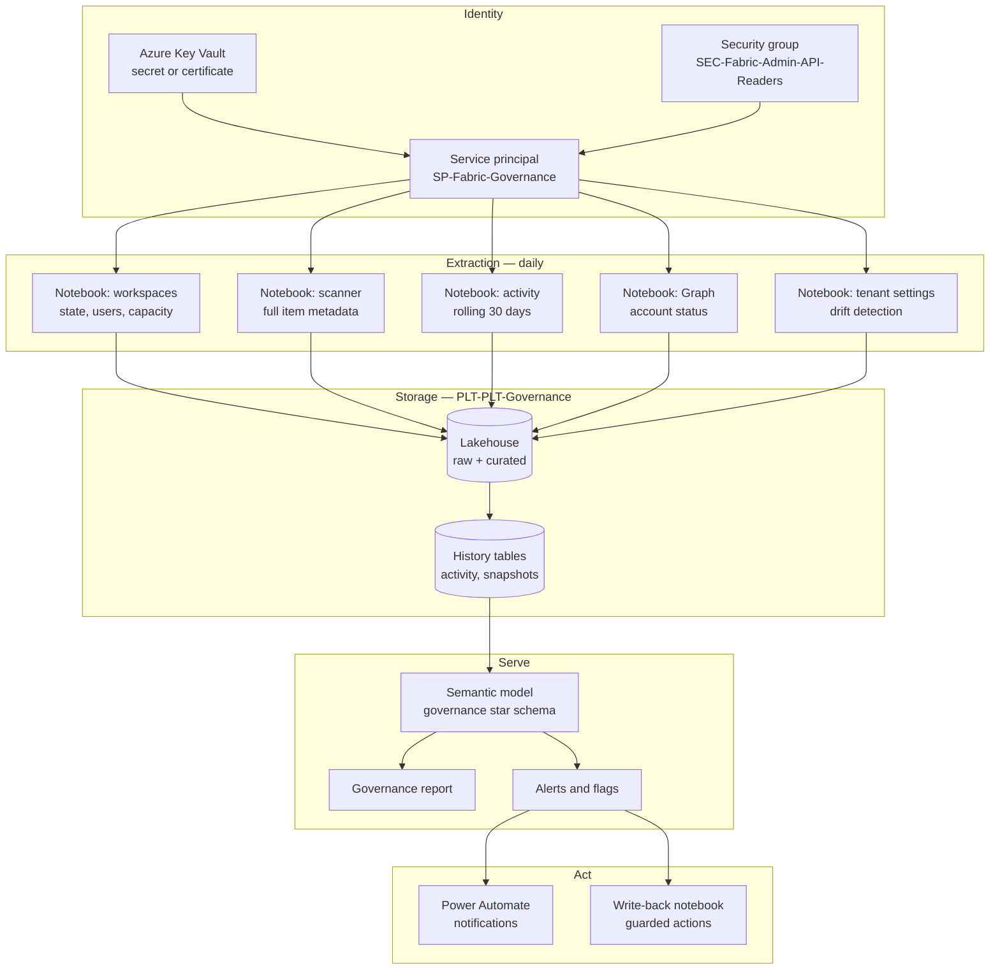

# Annex B — Automation architecture for administration and monitoring

Companion to `powerbi-governance-framework.md`. Covers requirement 12: automating recurring admin tasks, flags, and monitoring.

---

## B1. The choice: admin account vs service principal

| Approach | How it works | Verdict |
|---|---|---|
| **Named Fabric Administrator account** | A person signs in and runs scripts or the portal | Fine for interactive investigation and irreversible actions. **Not viable for scheduled automation** — MFA, password rotation, and the audit trail pointing at a human who did not do it. |
| **Service principal (Entra app registration)** | Registered app, added to a security group, enabled via tenant setting, authenticates with a secret or certificate | **Recommended default.** Purpose-built for this. Clean audit trail. Most Fabric admin APIs support it. |
| **Managed identity** | Azure resource identity, no secret to manage | Best option **if** the compute runs on an Azure resource that supports it. Most Fabric admin APIs support SPN and MI authentication. Removes secret management entirely. |

**Recommendation: a dedicated service principal for admin/monitoring, with a managed identity used instead wherever the compute host supports it.** Do not reuse an existing SP from another integration — a dedicated one gives isolated access and a clear audit trail, and avoids over-permissioning.

### Known limitations to design around

- **The app must not have admin-consent-required Power BI API permissions registered in Azure.** This is counter-intuitive and it is the single most common reason SP access to read-only admin APIs fails. Access is granted through the *tenant setting and security group*, not through API permissions. If someone "helpfully" grants Power BI application permissions in the Azure portal, the read-only admin APIs stop working.
- **A service principal cannot sign in to the Fabric portal.** It can only call APIs. Keep a break-glass admin account for anything requiring the UI.
- **Sensitivity label admin APIs do not work with SPN or managed identity** — applying or removing a label requires a user principal token. Label *reading* through the scanner is fine.
- **Read and write are separate tenant settings.** "Service principals can access read-only admin APIs" is distinct from "Service principals can access admin APIs used for updates." Start with read-only.

---

## B2. Setup

| # | Step | Who | Notes |
|---|---|---|---|
| 1 | Register an Entra application: `SP-Fabric-Governance` | Entra admin | Record tenant ID, client ID |
| 2 | Create a client secret **or** upload a certificate | Entra admin | Certificate preferred; store in Azure Key Vault either way |
| 3 | **Do not add any Power BI API permissions** | Entra admin | See B1 limitations |
| 4 | Create security group `SEC-Fabric-Admin-API-Readers`, add the SP | Entra admin | |
| 5 | Admin portal → tenant settings → enable **Service principals can access read-only admin APIs** for that group | Fabric admin | |
| 6 | Enable **Enhance admin API responses with detailed metadata** for the same group | Fabric admin | Without this the scan is shallow and item-level analysis is impossible |
| 7 | Enable **Enhance admin API responses with DAX and mashup expressions** `[DECIDE]` | Fabric admin | Needed for lineage and duplicate-model detection; exposes query text, so confirm with security |
| 8 | Store the secret in Azure Key Vault; grant the compute identity read access | Platform | |
| 9 | Validate: call `GetGroupsAsAdmin` and confirm a non-empty response | Governance lead | Settings can take ~15 minutes to take effect |
| 10 | Later, if write automation is approved: enable **Service principals can access admin APIs used for updates** | Fabric admin | Separate approval, separate change record |

Step 5 is the critical path for the whole engagement. Raise it in week 1.

---

## B3. API catalog

| Purpose | API | Notes |
|---|---|---|
| Workspace list, state, type, capacity | Admin — `GetGroupsAsAdmin` | Supports `$expand=users` for the permission snapshot |
| **Full metadata inventory** | Admin — `PostWorkspaceInfo` (`/admin/workspaces/getInfo`) → `GetScanStatus` → `GetScanResult` | **Max 100 workspaces per request.** 4,000 workspaces = 40+ batches. Asynchronous: submit, poll status, fetch result. |
| Incremental scanning | Admin — `GetModifiedWorkspaces` | Returns workspaces changed since a timestamp. Use this for daily runs; full scan weekly. |
| Activity events | Admin — `GetActivityEvents` | **One day per request, ~30-day rolling window.** Throttled — design for retry. `[VERIFY current rate limits]` |
| Capacities | Admin — `GetCapacitiesAsAdmin` | Plus the Fabric Capacity Metrics app for utilization detail |
| Domains | Fabric Admin — Domains APIs | List, create, assign workspaces, manage domain roles |
| Tenant settings and overrides | Fabric Admin — Tenants: `ListTenantSettings`, plus overrides at capacity, workspace and domain level | Enables drift detection on your own baseline |
| Apps | Admin — `GetAppsAsAdmin` | |
| **User account status** | **Microsoft Graph** `/users?$select=id,userPrincipalName,accountEnabled` | Not a Power BI API. This is what turns "has an admin" into "has an *active* admin". Requires its own Graph permission on the SP. |
| Add an admin to a workspace | Admin — `AddUserAsAdmin` | Write. The fix for orphaned workspaces. |
| Delete a workspace | Admin — `DeleteWorkspaceAsAdmin` | Write. Destructive. |
| Restore a workspace | Fabric Admin — Workspaces `RestoreWorkspace` | Write. Note: **does not restore permissions.** |
| Assign workspace to domain | Fabric Admin — Domains assign APIs | Write. Bulk domain assignment during migration. |
| Remove sharing links | Fabric Admin — `RemoveAllSharingLinks` / `RemoveSharingLinks` | Write. Wave 0 remediation. Irreversible. |

**Throttling reality at 4,000 workspaces.** Scanner batches of 100 and one-day-per-call activity events mean the daily pipeline is dozens to hundreds of calls. Build in exponential backoff and continuation-token handling from the start — it is not an optimization, it is a requirement at this scale.

---

## B4. Compute options

| Option | Fit | Trade-off |
|---|---|---|
| **Fabric notebook + data pipeline** | **Recommended.** Python, `sempy` pre-installed, `semantic-link-labs` wraps most admin APIs, lands directly in a Lakehouse, schedules natively, no external infrastructure | Consumes Fabric capacity; needs a Fabric capacity to exist |
| Azure Function (timer-triggered) | Good if Fabric capacity is unavailable or the team prefers Azure-native | Separate deployment and monitoring surface |
| Azure Automation runbook (PowerShell) | Familiar to IT ops teams; `MicrosoftPowerBIMgmt` module | PowerShell module coverage lags the newer Fabric APIs |
| Azure Data Factory / Synapse | Fine if already the standard orchestrator | Verbose for REST-heavy work |
| Logic Apps / Power Automate | **Use for the notification layer, not the extraction layer** | Poor fit for pagination and batching |

**Recommendation: Fabric notebooks orchestrated by a Fabric data pipeline, running in the `PLT-PLT-Governance` workspace, with Power Automate handling notifications.** Given a Python/Databricks background this is the lowest-friction path, and it keeps the governance solution inside the platform it governs — which is also a useful demonstration to the customer.

### Key library

`semantic-link-labs` (`sempy_labs`) is a Microsoft-maintained Python library for Fabric notebooks. Its `sempy_labs.admin` module wraps the admin REST APIs: workspace listing including orphaned and modified workspaces, the Scanner API with continuation-token handling built in, domain management, capacity administration, tenant settings, and workspace access management. It supports service principal authentication with secrets held in Azure Key Vault.

This turns most of what would be hand-rolled REST plumbing into DataFrame operations, which is the right level of abstraction for this work.

There is also a **Fabric Jumpstart "Fabric Inventory"** solution that deploys a tenant-wide inventory stack — extraction notebooks built on `sempy_labs`, data pipelines, an Eventhouse-backed KQL database, and a real-time dashboard. Evaluate it before building from scratch; even if it is not adopted wholesale, its data model is a useful reference. `[VERIFY current availability and fit]`

---

## B5. Reference architecture



### Data model

| Table | Grain | Refresh |
|---|---|---|
| `dim_workspace` | One row per workspace, current state | Daily |
| `dim_workspace_history` | One row per workspace per snapshot date | Daily, retained indefinitely |
| `dim_user` | One row per user, incl. `accountEnabled` from Graph | Daily |
| `dim_item` | One row per item | Daily |
| `dim_domain`, `dim_capacity` | Reference | Weekly |
| `fact_workspace_access` | Workspace × principal × role | Daily — **this is the permission snapshot; never truncate** |
| `fact_activity` | One row per activity event | Daily append |
| `fact_refresh` | One row per refresh operation | Daily |
| `fact_compliance` | Workspace × control × date × pass/fail | Daily |

`fact_workspace_access` history is what makes deletion safe, because workspace restore does not bring permissions back. Treat it as the most important table in the model.

---

## B6. Code pattern

Illustrative skeleton for a Fabric notebook. Verify function signatures against the installed `semantic-link-labs` version — the API surface moves quickly.

```python
%pip install semantic-link-labs -q

import sempy_labs as labs
from sempy_labs import admin
import pandas as pd
from datetime import datetime, timedelta

# --- Authentication: service principal, secret from Key Vault -----------------
labs.service_principal_authentication(
    key_vault_uri="https://<vault>.vault.azure.net/",
    key_vault_tenant_id="fabric-tenant-id",
    key_vault_client_id="fabric-sp-client-id",
    key_vault_client_secret="fabric-sp-secret",
)

SNAPSHOT_DATE = datetime.utcnow().date()

# --- 1. Workspace inventory ---------------------------------------------------
ws = admin.list_workspaces()          # id, name, state, type, capacity
ws["snapshot_date"] = SNAPSHOT_DATE

# --- 2. Permission snapshot ---------------------------------------------------
access = []
for wid in ws["Id"]:
    try:
        u = admin.list_workspace_users(workspace=wid)
        u["workspace_id"] = wid
        access.append(u)
    except Exception as e:
        print(f"access failed {wid}: {e}")
access = pd.concat(access, ignore_index=True)
access["snapshot_date"] = SNAPSHOT_DATE

# --- 3. Full metadata scan, batched at 100 ------------------------------------
def scan_all(workspace_ids, batch_size=100):
    results = []
    for i in range(0, len(workspace_ids), batch_size):
        batch = list(workspace_ids[i:i + batch_size])
        results.append(admin.scan_workspaces(workspace=batch))
    return results

scan_results = scan_all(ws["Id"].tolist())

# --- 4. Graph: which accounts are still active --------------------------------
#     Requires a Graph permission on the SP, separate from Power BI settings.
#     users_df = get_graph_users()   ->  id, userPrincipalName, accountEnabled

# --- 5. Derived governance flags ----------------------------------------------
import re
NAME_RE = re.compile(
    r"^(FIN|COM|SCM|OPS|HRS|TEC|PLT)-(DAT|RPT|WRK|SBX|PLT)-[A-Za-z0-9]{2,30}(-(DEV|TST|PRD))?$"
)

admins = access[access["role"].str.lower() == "admin"]
active_admins = (
    admins.merge(users_df, left_on="user_id", right_on="id", how="left")
          .query("accountEnabled == True")
          .groupby("workspace_id").size()
          .rename("active_admin_count")
)

flags = (
    ws.merge(active_admins, left_on="Id", right_index=True, how="left")
      .assign(
          active_admin_count=lambda d: d["active_admin_count"].fillna(0),
          has_active_owner=lambda d: d["active_admin_count"] > 0,
          name_compliant=lambda d: d["Name"].apply(lambda n: bool(NAME_RE.match(str(n)))),
          is_orphaned_state=lambda d: d["State"].eq("Orphaned"),
      )
)

# --- 6. Persist ---------------------------------------------------------------
# spark.createDataFrame(flags).write.mode("append").saveAsTable("dim_workspace_history")
```

### Activity events — the pattern that matters

```python
# One day per request, ~30-day rolling window. Run daily; never backfill-dependent.
def fetch_activity(day):
    return admin.list_activity_events(
        start_time=f"{day}T00:00:00Z",
        end_time=f"{day}T23:59:59Z",
    )

yesterday = (datetime.utcnow() - timedelta(days=1)).date().isoformat()
events = fetch_activity(yesterday)
# append to fact_activity — the history only exists if you accumulate it
```

**Start this on day one of the engagement**, before the assessment is even scoped. Activity history cannot be obtained retroactively beyond the rolling window, and 90-day usage signals are what the entire triage ladder depends on.

---

## B7. What to automate, in priority order

| Priority | Automation | Type | Value |
|---|---|---|---|
| 1 | Daily inventory + permission snapshot | Read | Everything else depends on it |
| 2 | Daily activity capture | Read | Time-critical — history accrues from day one |
| 3 | Naming compliance check | Read + flag | Cheap, immediate, continuously useful |
| 4 | Orphaned / no-active-admin detection | Read + flag | Directly addresses the customer's core problem |
| 5 | Publish-to-web and guest-user detection | Read + flag | Security |
| 6 | Dormancy detection and lifecycle transitions | Read + notify | Prevents recurrence |
| 7 | **Auto-add BI platform group as Admin on any workspace missing one** | **Write** | The single highest-value write action. Structurally prevents orphaning. |
| 8 | Workspace provisioning from the request form | Write | Makes restricted creation politically viable |
| 9 | SBX expiry archiving | Write | Keeps the sandbox tier honest |
| 10 | Domain assignment in bulk | Write | Migration accelerator |
| 11 | Tenant settings drift detection | Read + flag | Catches silent regressions |
| 12 | Capacity utilization alerting | Read + flag | Cost and performance |

Items 1–6 are read-only and can ship before any write approval exists. **Deliver those first** — they produce the evidence for the proposal and prove the pipeline works before anyone is asked to approve write access.

### Guardrails on write automation

Non-negotiable for anything destructive:

1. **Dry-run mode by default.** Every write job first produces the list of intended actions and writes it to a table. A separate, explicit run executes.
2. **Blast-radius cap.** No single run may act on more than N workspaces `[DECIDE — suggest 100]`. Anything larger requires a deliberate override.
3. **Snapshot before act.** No destructive action executes unless a current permission snapshot exists for that workspace.
4. **Full action log.** Every write appends to an immutable audit table: what, why, which rule, which run.
5. **Exclusion list.** A maintained list of workspaces automation never touches, regardless of rules.
6. **Never automate permanent delete.** Soft-delete only. Permanent deletion stays a manual, human, logged action.

---

## B8. Alternatives and complements

| Tool | What it adds | When to consider |
|---|---|---|
| **Fabric Capacity Metrics app** | Capacity utilization, throttling, item-level compute | Always. Free, first-party, no build effort. |
| **Fabric workspace monitoring** | Per-workspace telemetry into an Eventhouse | For deep diagnostics on high-value workspaces `[VERIFY current availability]` |
| **Microsoft Purview** | Sensitivity labels, lineage beyond Power BI, DLP | If classification is in scope. Complements, does not replace, this pipeline. |
| **Log Analytics integration** | Semantic model engine-level events | For performance troubleshooting on critical models |
| **`MicrosoftPowerBIMgmt` PowerShell** | Familiar cmdlets, including workspace restore | For interactive admin tasks and IT-ops-owned runbooks |
| **Fabric Jumpstart — Fabric Inventory** | A pre-built inventory stack with dashboards | Evaluate before building. Reference data model at minimum. |
| **Third-party governance platforms** | Packaged catalog, lineage, cost management | Only if the customer wants to buy rather than build. Assess after the inventory exists — the requirements will be clearer and the negotiating position better. |

---

## B9. Build effort

| Component | Effort | Dependency |
|---|---|---|
| Service principal setup and validation | 2 days | Entra + Fabric admin availability |
| Workspace + permission extraction | 3 days | SP working |
| Scanner API extraction with batching | 4 days | Detailed metadata setting enabled |
| Activity events extraction | 2 days | — |
| Graph integration for account status | 2 days | Graph permission granted |
| Curated model and derived flags | 4 days | All extractions working |
| Governance semantic model and report | 5 days | Curated model |
| Alerting and notification flows | 3 days | Report |
| Write-back framework with guardrails | 5 days | Write tenant setting approved |
| Documentation and handover | 3 days | — |

**Read-only pipeline: ~4 weeks.** Adding write automation: ~2 more.

The gating item is not effort, it is the tenant setting in B2 step 5. Everything downstream waits on it, so raise it before anything else.
