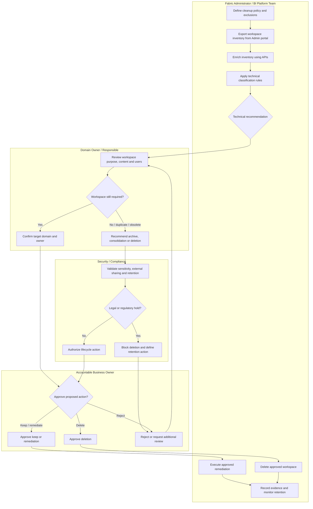
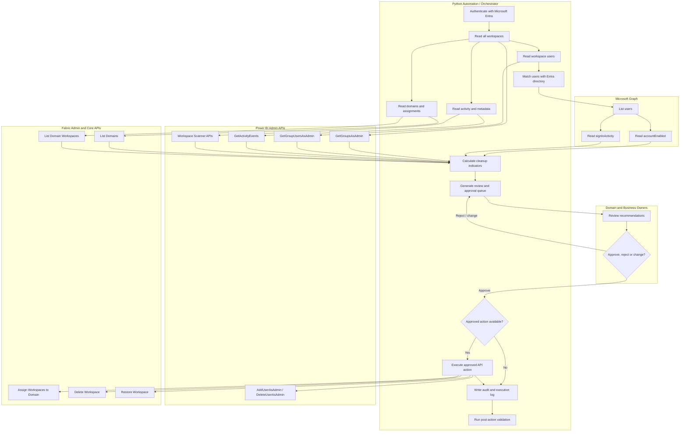

# Power BI/Fabric Workspace Cleanup Guide

## 1. Purpose

This guide defines a controlled process to clean up approximately **4,000 existing Power BI and Microsoft Fabric workspaces**.

The approach combines:

1. **Fabric Administration portal activities**
2. **Power BI and Fabric REST APIs**
3. **Microsoft Graph for user validation**
4. **Python automation**
5. **Business-owner review and approval**
6. **Audit, remediation, archive, and deletion controls**

The recommended model is:

- Use automation for discovery, enrichment, and classification.
- Use business owners for validation.
- Use controlled API operations for remediation.
- Do not automatically delete workspaces during the first execution.

APIs can identify technical conditions, but they cannot determine whether an apparently inactive workspace still has regulatory, operational, or business value.

---

## 2. Target Cleanup Outcomes

Each workspace should finish in one of the following categories:

| Category | Meaning | Typical action |
|---|---|---|
| Keep | Active, owned, and correctly classified | No change |
| Remediate | Active but with governance problems | Correct owner, users, name, domain, or capacity |
| Reassign | Belongs to another business domain | Assign to the correct domain |
| Review | No recent activity or unclear purpose | Business-owner attestation |
| Archive candidate | No activity but content might still be required | Preserve or export content and apply review period |
| Delete candidate | Empty, duplicated, abandoned, or formally rejected | Approved deletion |
| Restore | Accidentally deleted or still required | Restore during retention |
| Exclude | My Workspace, admin monitoring, platform, or protected workspace | Remove from cleanup scope |

The Fabric Admin portal identifies workspace states such as:

- Active
- Orphaned
- Deleted
- Removing
- Not found

An **orphaned workspace** means that it has no administrator. It does not automatically mean that the workspace is inactive.

Reference:

- https://learn.microsoft.com/en-us/fabric/admin/portal-workspaces

---

## 3. Important Limitation: Defining Inactivity

There are three different inactivity concepts:

| Indicator | Interpretation | Limitation |
|---|---|---|
| No ActivityEvents | No recorded Power BI/Fabric activity during the selected period | The API only provides the preceding 28 days |
| Unused artifacts | Reports, dashboards, and semantic models not used in 30 days | Preview API; does not cover every Fabric item |
| Inactive Entra user | User account disabled or without sign-in activity | Requires Microsoft Graph and additional licensing or permissions |

The Power BI Activity Events API retrieves events within the previous **28 days**, with one UTC day per request.

Therefore, a first execution cannot prove that a workspace has been inactive for 90 or 180 days unless the organization already stores historical Power BI events or uses Microsoft Purview Audit.

References:

- https://learn.microsoft.com/en-us/rest/api/power-bi/admin/get-activity-events
- https://learn.microsoft.com/en-us/purview/audit-log-retention-policies

### Recommended inactivity labels

Use explicit indicators rather than a generic `inactive` flag:

```text
NO_ACTIVITY_OBSERVED_28D
ALL_SUPPORTED_ARTIFACTS_UNUSED_30D
OWNER_ACCOUNT_DISABLED
NO_VALID_WORKSPACE_ADMIN
EMPTY_WORKSPACE
NO_DOMAIN_ASSIGNED
BUSINESS_VALIDATION_PENDING
```

A workspace should not become an automatic deletion candidate solely because it has `NO_ACTIVITY_OBSERVED_28D`.

---

## 4. Fabric Administration Portal Cleanup Process

### Phase 0 — Define Policy and Scope

Before opening the portal:

1. Approve workspace lifecycle rules.
2. Define protected workspaces:
   - Admin monitoring workspaces
   - Production workspaces
   - Deployment pipeline workspaces
   - Regulatory or legal workspaces
   - Shared enterprise semantic-model workspaces
   - My Workspaces, unless handled as a separate initiative
3. Define required workspace metadata:
   - Business domain
   - Business owner
   - Technical owner
   - At least two workspace administrators
   - Description
   - Environment: Development, Test, or Production
   - Retention classification
4. Define approval authority:
   - Responsible person evaluates.
   - Accountable person approves deletion.
   - IT contact executes or validates technical actions.

### Phase 1 — Export and Inventory

In Microsoft Fabric:

1. Open **Settings**.
2. Open **Admin portal**.
3. Select **Workspaces**.
4. Select **Export** to create the initial CSV.
5. Capture:
   - Workspace ID
   - Name
   - Description
   - Type
   - State
   - Capacity
   - Capacity SKU
6. Separate:
   - Collaborative workspaces
   - Personal workspaces
   - Orphaned workspaces
   - Deleted workspaces
   - Admin or system workspaces

The Admin portal requires a Fabric license and an appropriate administrator role.

Reference:

- https://learn.microsoft.com/en-us/fabric/admin/admin-overview

### Phase 2 — Enrich the Inventory

For every in-scope workspace, add:

- Domain and subdomain
- Workspace administrators
- Members
- Contributors
- Viewers
- Item counts by type
- Last recorded workspace activity
- Last report view
- Last item modification
- Last semantic-model refresh
- Disabled or deleted users
- Deployment pipeline association
- Capacity assignment
- Sensitivity label
- Endorsement
- Lineage, where available

Because manually inspecting 4,000 workspaces is not practical, this phase should be primarily API-driven.

### Phase 3 — Automated Classification

Apply rules such as:

| Rule | Initial result |
|---|---|
| Workspace state is Orphaned | Remediate owner |
| No active workspace administrator | Remediate owner |
| No domain | Assign domain |
| Disabled user has Admin or Member role | Remove or replace access |
| Individual users are used instead of managed groups | Access remediation |
| No description or nonstandard name | Metadata remediation |
| Empty workspace and no recent activity | Delete candidate |
| Non-empty workspace with no recent activity | Business review |
| Deleted workspace still required | Restore |
| Production workspace with activity | Keep |
| Personal workspace | Separate My Workspace process |

### Phase 4 — Business Validation

Send each domain owner a review file containing:

- Workspace name and ID
- Description
- Current administrators
- Item count
- Activity indicators
- Current domain
- Proposed domain
- Recommended action
- Required approval date
- Responsible person
- Accountable person
- IT contact

Available decisions:

- Keep
- Keep and remediate
- Move to another domain
- Replace owner
- Consolidate with another workspace
- Archive
- Delete
- Escalate

No response should normally result in **escalation or quarantine**, not immediate deletion.

### Phase 5 — Remediation

Use the Admin portal or API to:

- Add a valid administrator.
- Replace individuals with Microsoft Entra security groups.
- Remove disabled users and obsolete guest users.
- Update workspace name and description.
- Assign the workspace to a domain.
- Reassign capacity where necessary.
- Consolidate duplicated content.
- Restore a deleted workspace when required.

Fabric domains support:

- Fabric administrators
- Domain administrators
- Domain contributors

Reference:

- https://learn.microsoft.com/en-us/fabric/governance/domains

### Phase 6 — Controlled Deletion

Before deletion:

1. Require Accountable-owner approval.
2. Confirm that:
   - No production application depends on the workspace.
   - No deployment pipeline depends on it.
   - No report or semantic model is shared externally.
   - Required content has been migrated or exported.
   - Regulatory retention requirements have been checked.
3. Store:
   - Approval
   - Workspace metadata
   - User list
   - Item list
   - Deletion timestamp
   - Executor
4. Delete the workspace.
5. Retain the deletion record during the retention period.

Reference:

- https://learn.microsoft.com/en-us/fabric/admin/portal-workspaces

---

## 5. Admin Portal Swimlane Diagram



---

## 6. API Automation Architecture

Use three API families:

| API family | Main purpose |
|---|---|
| Power BI Admin REST API | Tenant inventory, workspace users, activity events, metadata scanning |
| Fabric REST API | Domains, domain assignment, Fabric workspace operations |
| Microsoft Graph | Account status, user matching, Entra sign-in activity |

Recommended architecture:

```text
Microsoft Entra app registrations
          │
          ├── Read-only inventory service principal
          │       ├── Power BI Admin REST APIs
          │       ├── Fabric Admin REST APIs
          │       └── Optional Microsoft Graph
          │
          └── Controlled write identity
                  ├── Domain assignment
                  ├── Access remediation
                  ├── Workspace metadata changes
                  └── Approved deletion

API extraction
     ↓
Raw JSON storage
     ↓
Normalized workspace, item, user and activity tables
     ↓
Rules and classification engine
     ↓
Power BI review dashboard / CSV approval queue
     ↓
Business approval
     ↓
Controlled API execution
     ↓
Execution log and post-action validation
```

For security, separate the **read-only inventory identity** from the **write identity**.

Use one of the following rather than storing secrets directly in Python source code:

- Federated credentials
- Managed identity
- Certificate authentication
- Secret stored in Azure Key Vault

Reference:

- https://learn.microsoft.com/en-us/fabric/admin/enable-service-principal-admin-apis

---

## 7. API Automation Swimlane Diagram



---

## 8. Roles, Permissions, Licenses, and Tenant Settings

### 8.1 Admin Portal

| Requirement | Description |
|---|---|
| User license | A Fabric license is required to access the complete Admin portal |
| Admin role | Fabric Administrator or Power Platform Administrator |
| Role assignment | Normally assigned from the Microsoft 365 Admin Center |
| Capacity admin alone | Can manage assigned capacities but does not receive all tenant administration capabilities |

References:

- https://learn.microsoft.com/en-us/fabric/admin/admin-overview
- https://learn.microsoft.com/en-us/fabric/admin/roles

### 8.2 Read-Only Service Principal

Create:

1. Microsoft Entra app registration.
2. Security group for approved Fabric administration applications.
3. Add the service principal to that security group.
4. In the Fabric Admin portal:
   - Open **Tenant settings**.
   - Open **Admin API settings**.
   - Enable **Service principals can access read-only admin APIs**.
   - Limit access to the approved security group.

Reference:

- https://learn.microsoft.com/en-us/fabric/admin/enable-service-principal-admin-apis

### 8.3 Fabric Update APIs

For operations such as bulk domain assignment:

1. Enable **Service principals can access admin APIs used for updates**.
2. Add the service principal to the permitted security group.
3. Confirm that the individual Fabric API supports service principals.
4. Use a Fabric API access token.
5. Respect API-specific administrator requirements.

Reference:

- https://learn.microsoft.com/en-us/rest/api/fabric/admin/domains/assign-domain-workspaces-by-ids

### 8.4 Fabric Public/Core APIs

For operations protected by workspace permissions, such as deleting a workspace:

1. Enable **Service principals can call Fabric public APIs** under Developer settings.
2. Add the service principal to the allowed security group.
3. Give the service principal the required workspace role.
4. For deleting a workspace, the caller must be a workspace Administrator.

Reference:

- https://learn.microsoft.com/en-us/fabric/admin/service-admin-portal-developer

### 8.5 Metadata Scanning

Metadata scanning:

- Requires Fabric administrator access or an approved service principal.
- Supports up to 100 workspace IDs per scan request.
- Allows up to 16 simultaneous scan requests.
- Does not require a special Premium or Fabric capacity license.
- Can return item metadata, lineage, datasource details, owners, labels, and optional semantic-model metadata.

References:

- https://learn.microsoft.com/en-us/fabric/governance/metadata-scanning-overview
- https://learn.microsoft.com/en-us/fabric/governance/metadata-scanning-run
- https://learn.microsoft.com/en-us/rest/api/power-bi/admin/workspace-info-post-workspace-info

### 8.6 Microsoft Graph for Inactive or Disabled Users

Basic user matching can use:

- `User.Read.All`
- `Directory.Read.All`

To retrieve `signInActivity`, Microsoft requires:

- Microsoft Entra ID P1 or P2
- `AuditLog.Read.All`

Reference:

- https://learn.microsoft.com/en-us/graph/api/user-list?view=graph-rest-1.0

For least privilege, consider using a separate Entra app registration for Microsoft Graph rather than adding directory permissions to the Fabric inventory application.

---

## 9. Relevant API Calls

| Function | Endpoint | Main permission or condition |
|---|---|---|
| List tenant workspaces | `GET https://api.powerbi.com/v1.0/myorg/admin/groups` | Fabric admin or approved read-only service principal |
| Get workspace users | `GET https://api.powerbi.com/v1.0/myorg/admin/groups/{workspaceId}/users` | Fabric admin or approved read-only service principal |
| Read activity events | `GET https://api.powerbi.com/v1.0/myorg/admin/activityevents` | Fabric admin or approved read-only service principal |
| Start metadata scan | `POST https://api.powerbi.com/v1.0/myorg/admin/workspaces/getInfo` | Fabric admin or approved read-only service principal |
| Find unused artifacts | `GET https://api.powerbi.com/v1.0/myorg/admin/groups/{workspaceId}/unused` | Preview; tenant read access |
| List domains | `GET https://api.fabric.microsoft.com/v1/admin/domains?preview=false` | Fabric admin |
| List domain workspaces | `GET https://api.fabric.microsoft.com/v1/admin/domains/{domainId}/workspaces` | Fabric admin |
| Assign workspaces to domain | `POST https://api.fabric.microsoft.com/v1/admin/domains/{domainId}/assignWorkspaces` | Fabric admin and update API access |
| Add workspace principal as admin | `POST https://api.powerbi.com/v1.0/myorg/admin/groups/{workspaceId}/users` | Delegated Fabric admin; `Tenant.ReadWrite.All` |
| Remove workspace principal | `DELETE https://api.powerbi.com/v1.0/myorg/admin/groups/{workspaceId}/users/{principal}` | Delegated Fabric admin; `Tenant.ReadWrite.All` |
| Delete workspace | `DELETE https://api.fabric.microsoft.com/v1/workspaces/{workspaceId}` | Caller must be workspace Administrator |
| Restore workspace | `POST https://api.powerbi.com/v1.0/myorg/admin/groups/{workspaceId}/restore` | Fabric admin; `Tenant.ReadWrite.All` |

### Scale Recommendation

For the first run:

1. Read all workspace metadata.
2. Identify only:
   - Orphaned workspaces
   - Empty workspaces
   - Workspaces without domains
   - Workspaces without descriptions
   - Workspaces with no observed activity
3. Retrieve detailed users only for those workspaces.
4. Retrieve users for active and compliant workspaces later as part of steady-state governance.

This avoids immediately executing thousands of user-list calls.

---

## 10. Python Starter Implementation

Install the required libraries:

```bash
pip install msal requests pandas
```

Set credentials as environment variables:

```text
FABRIC_TENANT_ID
FABRIC_CLIENT_ID
FABRIC_CLIENT_SECRET
```

### Reusable Python Module

```python
from __future__ import annotations

import os
import time
from dataclasses import dataclass
from datetime import datetime, timedelta, timezone
from typing import Any, Iterable

import msal
import pandas as pd
import requests


PBI_SCOPE = "https://analysis.windows.net/powerbi/api/.default"
FABRIC_SCOPE = "https://api.fabric.microsoft.com/.default"
GRAPH_SCOPE = "https://graph.microsoft.com/.default"

PBI_BASE = "https://api.powerbi.com/v1.0/myorg"
FABRIC_BASE = "https://api.fabric.microsoft.com/v1"
GRAPH_BASE = "https://graph.microsoft.com/v1.0"


@dataclass(frozen=True)
class Settings:
    tenant_id: str
    client_id: str
    client_secret: str

    @classmethod
    def from_environment(cls) -> "Settings":
        required = {
            "tenant_id": os.getenv("FABRIC_TENANT_ID"),
            "client_id": os.getenv("FABRIC_CLIENT_ID"),
            "client_secret": os.getenv("FABRIC_CLIENT_SECRET"),
        }

        missing = [name for name, value in required.items() if not value]
        if missing:
            raise RuntimeError(
                f"Missing required environment variables: {', '.join(missing)}"
            )

        return cls(**required)


class AppTokenProvider:
    """Acquire application tokens using the OAuth client-credentials flow."""

    def __init__(self, settings: Settings) -> None:
        authority = f"https://login.microsoftonline.com/{settings.tenant_id}"

        self._app = msal.ConfidentialClientApplication(
            client_id=settings.client_id,
            client_credential=settings.client_secret,
            authority=authority,
        )

    def get_token(self, scope: str) -> str:
        result = self._app.acquire_token_for_client(scopes=[scope])

        token = result.get("access_token")
        if not token:
            error = result.get("error", "unknown_error")
            description = result.get(
                "error_description",
                "Microsoft Entra did not return an access token.",
            )
            raise RuntimeError(f"{error}: {description}")

        return token


class ApiClient:
    """HTTP client with token renewal, throttling, and retry handling."""

    def __init__(
        self,
        token_provider: AppTokenProvider,
        scope: str,
        max_retries: int = 6,
    ) -> None:
        self._token_provider = token_provider
        self._scope = scope
        self._max_retries = max_retries
        self._session = requests.Session()

    def request(
        self,
        method: str,
        url: str,
        **kwargs: Any,
    ) -> requests.Response:
        for attempt in range(self._max_retries):
            token = self._token_provider.get_token(self._scope)

            headers = kwargs.pop("headers", {})
            headers.update(
                {
                    "Authorization": f"Bearer {token}",
                    "Content-Type": "application/json",
                }
            )

            response = self._session.request(
                method=method,
                url=url,
                headers=headers,
                timeout=120,
                **kwargs,
            )

            if response.status_code == 429:
                delay = int(
                    response.headers.get(
                        "Retry-After",
                        min(60, 2 ** attempt),
                    )
                )
                time.sleep(delay)
                continue

            if 500 <= response.status_code < 600:
                time.sleep(min(60, 2 ** attempt))
                continue

            if not response.ok:
                raise RuntimeError(
                    f"{method} {url} failed with "
                    f"{response.status_code}: {response.text}"
                )

            return response

        raise RuntimeError(
            f"{method} {url} failed after {self._max_retries} attempts."
        )

    def get_json(self, url: str, **kwargs: Any) -> dict[str, Any]:
        response = self.request("GET", url, **kwargs)
        return response.json() if response.content else {}

    def post_json(
        self,
        url: str,
        payload: dict[str, Any],
    ) -> dict[str, Any]:
        response = self.request("POST", url, json=payload)
        return response.json() if response.content else {}


def chunked(values: list[str], size: int) -> Iterable[list[str]]:
    for start in range(0, len(values), size):
        yield values[start : start + size]


def list_workspaces(
    pbi_client: ApiClient,
    page_size: int = 5000,
) -> pd.DataFrame:
    """Read all tenant workspaces visible to the Admin API."""
    if not 1 <= page_size <= 5000:
        raise ValueError("page_size must be between 1 and 5000.")

    records: list[dict[str, Any]] = []
    skip = 0

    while True:
        url = f"{PBI_BASE}/admin/groups?$top={page_size}&$skip={skip}"
        data = pbi_client.get_json(url)
        page = data.get("value", [])
        records.extend(page)

        if len(page) < page_size:
            break

        skip += page_size

    return pd.DataFrame(records)


def get_workspace_users(
    pbi_client: ApiClient,
    workspace_id: str,
) -> pd.DataFrame:
    """Return workspace users, groups, and service principals."""
    url = f"{PBI_BASE}/admin/groups/{workspace_id}/users"
    data = pbi_client.get_json(url)

    frame = pd.DataFrame(data.get("value", []))
    if not frame.empty:
        frame.insert(0, "workspaceId", workspace_id)

    return frame


def get_users_for_candidates(
    pbi_client: ApiClient,
    workspace_ids: Iterable[str],
    delay_seconds: float = 18.5,
) -> pd.DataFrame:
    """Read users for selected workspaces while limiting API calls."""
    frames: list[pd.DataFrame] = []

    for workspace_id in workspace_ids:
        frames.append(get_workspace_users(pbi_client, workspace_id))
        time.sleep(delay_seconds)

    nonempty = [frame for frame in frames if not frame.empty]
    return pd.concat(nonempty, ignore_index=True) if nonempty else pd.DataFrame()


def get_activity_events(
    pbi_client: ApiClient,
    days: int = 28,
) -> pd.DataFrame:
    """Retrieve Power BI/Fabric activity events for complete UTC days."""
    if not 1 <= days <= 28:
        raise ValueError("days must be between 1 and 28.")

    all_events: list[dict[str, Any]] = []
    today_utc = datetime.now(timezone.utc).date()

    for days_ago in range(days, 0, -1):
        activity_date = today_utc - timedelta(days=days_ago)
        start = f"{activity_date.isoformat()}T00:00:00.000Z"
        end = f"{activity_date.isoformat()}T23:59:59.999Z"

        url = f"{PBI_BASE}/admin/activityevents"
        params = {
            "startDateTime": f"'{start}'",
            "endDateTime": f"'{end}'",
        }

        data = pbi_client.get_json(url, params=params)
        all_events.extend(data.get("activityEventEntities", []))

        continuation_url = data.get("continuationUri")
        while continuation_url:
            data = pbi_client.get_json(continuation_url)
            all_events.extend(data.get("activityEventEntities", []))
            continuation_url = data.get("continuationUri")

    frame = pd.DataFrame(all_events)

    if not frame.empty and "CreationTime" in frame.columns:
        frame["CreationTime"] = pd.to_datetime(
            frame["CreationTime"],
            utc=True,
            errors="coerce",
        )

    return frame


def list_domains(fabric_client: ApiClient) -> pd.DataFrame:
    """Return all Fabric domains and subdomains."""
    url = f"{FABRIC_BASE}/admin/domains?preview=false"
    data = fabric_client.get_json(url)
    return pd.DataFrame(data.get("domains", []))


def list_domain_workspaces(
    fabric_client: ApiClient,
    domain_id: str,
) -> pd.DataFrame:
    """Return all workspaces assigned to a domain."""
    url = f"{FABRIC_BASE}/admin/domains/{domain_id}/workspaces"
    records: list[dict[str, Any]] = []

    while url:
        data = fabric_client.get_json(url)
        records.extend(data.get("value", []))
        url = data.get("continuationUri")

    frame = pd.DataFrame(records)

    if not frame.empty:
        frame["domainId"] = domain_id
        frame.rename(
            columns={
                "id": "workspaceId",
                "displayName": "workspaceName",
            },
            inplace=True,
        )

    return frame


def build_workspace_domain_map(
    fabric_client: ApiClient,
) -> pd.DataFrame:
    """Create a workspace-to-domain mapping for all domains."""
    domains = list_domains(fabric_client)
    frames: list[pd.DataFrame] = []

    for domain in domains.to_dict("records"):
        workspaces = list_domain_workspaces(fabric_client, domain["id"])

        if workspaces.empty:
            continue

        workspaces["domainName"] = domain["displayName"]
        workspaces["parentDomainId"] = domain.get("parentDomainId")
        frames.append(workspaces)

    return pd.concat(frames, ignore_index=True) if frames else pd.DataFrame()


def assign_workspaces_to_domain(
    fabric_client: ApiClient,
    domain_id: str,
    workspace_ids: list[str],
    batch_size: int = 100,
    dry_run: bool = True,
) -> list[dict[str, Any]]:
    """Assign approved workspaces to a domain."""
    if not workspace_ids:
        return []

    operations: list[dict[str, Any]] = []
    url = f"{FABRIC_BASE}/admin/domains/{domain_id}/assignWorkspaces"

    for batch in chunked(workspace_ids, batch_size):
        operation = {
            "domainId": domain_id,
            "workspaceIds": batch,
            "dryRun": dry_run,
        }

        if not dry_run:
            fabric_client.post_json(url, {"workspacesIds": batch})

        operations.append(operation)

    return operations


def list_entra_users(graph_client: ApiClient) -> pd.DataFrame:
    """Return Entra account status and optional sign-in activity."""
    select_fields = (
        "id,displayName,userPrincipalName,mail,"
        "accountEnabled,signInActivity"
    )

    url = f"{GRAPH_BASE}/users?$select={select_fields}&$top=500"
    records: list[dict[str, Any]] = []

    while url:
        data = graph_client.get_json(url)
        records.extend(data.get("value", []))
        url = data.get("@odata.nextLink")

    frame = pd.json_normalize(records, sep="_")

    for column in [
        "signInActivity_lastSignInDateTime",
        "signInActivity_lastSuccessfulSignInDateTime",
    ]:
        if column in frame.columns:
            frame[column] = pd.to_datetime(
                frame[column],
                utc=True,
                errors="coerce",
            )

    return frame


def normalize_principal(value: Any) -> str | None:
    if value is None or pd.isna(value):
        return None
    return str(value).strip().lower()


def match_workspace_users_to_entra(
    workspace_users: pd.DataFrame,
    entra_users: pd.DataFrame,
) -> pd.DataFrame:
    """Match workspace role assignments to Entra accounts."""
    ws = workspace_users.copy()
    directory = entra_users.copy()

    ws["principalKey"] = (
        ws.get("emailAddress")
        .fillna(ws.get("identifier"))
        .map(normalize_principal)
    )

    directory["principalKey"] = (
        directory["userPrincipalName"]
        .fillna(directory.get("mail"))
        .map(normalize_principal)
    )

    return ws.merge(
        directory,
        on="principalKey",
        how="left",
        suffixes=("_workspace", "_entra"),
    )


def flag_inactive_workspace_users(
    matched_users: pd.DataFrame,
    activity_events: pd.DataFrame,
) -> pd.DataFrame:
    """Flag disabled, unmatched, and no-observed-activity users."""
    result = matched_users.copy()

    active_users: set[str] = set()
    if "UserId" in activity_events.columns:
        active_users = {
            value
            for value in activity_events["UserId"]
            .map(normalize_principal)
            .dropna()
            .tolist()
        }

    principal_type = result.get(
        "principalType",
        pd.Series(index=result.index, dtype="object"),
    )
    is_user = principal_type.eq("User")

    result["directoryAccountDisabled"] = (
        is_user
        & result.get(
            "accountEnabled",
            pd.Series(index=result.index, dtype="boolean"),
        ).eq(False)
    )

    result["directoryUserNotFound"] = (
        is_user
        & result.get(
            "id",
            pd.Series(index=result.index, dtype="object"),
        ).isna()
    )

    result["noObservedActivity"] = (
        is_user & ~result["principalKey"].isin(active_users)
    )

    result["recommendedUserAction"] = "KEEP"

    result.loc[
        result["directoryAccountDisabled"],
        "recommendedUserAction",
    ] = "REMOVE_OR_REPLACE_DISABLED_USER"

    result.loc[
        result["directoryUserNotFound"],
        "recommendedUserAction",
    ] = "INVESTIGATE_UNMATCHED_PRINCIPAL"

    result.loc[
        result["noObservedActivity"]
        & ~result["directoryAccountDisabled"]
        & ~result["directoryUserNotFound"],
        "recommendedUserAction",
    ] = "REVIEW_NO_ACTIVITY_IN_OBSERVATION_WINDOW"

    return result


def classify_workspaces(
    workspaces: pd.DataFrame,
    activity_events: pd.DataFrame,
    domain_map: pd.DataFrame,
    item_counts: pd.DataFrame | None = None,
) -> pd.DataFrame:
    """Produce an initial technical cleanup recommendation."""
    result = workspaces.copy()

    result.rename(
        columns={
            "id": "workspaceId",
            "name": "workspaceName",
        },
        inplace=True,
    )

    if not activity_events.empty and "WorkspaceId" in activity_events.columns:
        activity_summary = (
            activity_events.dropna(subset=["WorkspaceId"])
            .groupby("WorkspaceId", as_index=False)
            .agg(
                observedActivityCount=("WorkspaceId", "size"),
                lastObservedActivity=("CreationTime", "max"),
            )
            .rename(columns={"WorkspaceId": "workspaceId"})
        )
    else:
        activity_summary = pd.DataFrame(
            columns=[
                "workspaceId",
                "observedActivityCount",
                "lastObservedActivity",
            ]
        )

    result = result.merge(activity_summary, on="workspaceId", how="left")

    if not domain_map.empty:
        result = result.merge(
            domain_map[["workspaceId", "domainId", "domainName"]],
            on="workspaceId",
            how="left",
        )
    else:
        result["domainId"] = pd.NA
        result["domainName"] = pd.NA

    if item_counts is not None:
        result = result.merge(item_counts, on="workspaceId", how="left")
    elif "itemCount" not in result.columns:
        result["itemCount"] = pd.NA

    result["observedActivityCount"] = (
        result["observedActivityCount"].fillna(0).astype(int)
    )

    result["recommendedAction"] = "BUSINESS_REVIEW"
    result["recommendationReason"] = "No conclusive automated decision"

    personal = result["type"].isin(["PersonalGroup", "Personal"])
    deleted = result["state"].eq("Deleted")
    orphaned = result["state"].eq("Orphaned")
    no_domain = (
        result["domainId"].isna()
        & ~personal
        & ~deleted
        & ~orphaned
    )

    result.loc[personal, "recommendedAction"] = "EXCLUDE_OR_SEPARATE_PROCESS"
    result.loc[personal, "recommendationReason"] = "Personal workspace"

    result.loc[deleted, "recommendedAction"] = "REVIEW_RESTORE_OR_RETENTION"
    result.loc[deleted, "recommendationReason"] = "Workspace is already deleted"

    result.loc[orphaned, "recommendedAction"] = "REMEDIATE_OWNER"
    result.loc[orphaned, "recommendationReason"] = "Workspace has no administrator"

    result.loc[no_domain, "recommendedAction"] = "ASSIGN_DOMAIN"
    result.loc[no_domain, "recommendationReason"] = "No Fabric domain assignment"

    active = (
        result["observedActivityCount"].gt(0)
        & ~personal
        & ~deleted
        & ~orphaned
        & ~no_domain
    )

    result.loc[active, "recommendedAction"] = "KEEP"
    result.loc[active, "recommendationReason"] = (
        "Activity observed in extraction window"
    )

    empty_inactive = (
        result["itemCount"].fillna(-1).eq(0)
        & result["observedActivityCount"].eq(0)
        & ~personal
        & ~deleted
        & ~orphaned
    )

    result.loc[
        empty_inactive,
        "recommendedAction",
    ] = "DELETE_CANDIDATE_AFTER_APPROVAL"

    result.loc[
        empty_inactive,
        "recommendationReason",
    ] = "Empty and no activity observed"

    inactive_with_content = (
        result["itemCount"].fillna(0).gt(0)
        & result["observedActivityCount"].eq(0)
        & ~personal
        & ~deleted
        & ~orphaned
    )

    result.loc[
        inactive_with_content,
        "recommendedAction",
    ] = "OWNER_ATTESTATION_REQUIRED"

    result.loc[
        inactive_with_content,
        "recommendationReason",
    ] = "Content exists but no activity was observed"

    return result


def delete_workspace(
    fabric_client: ApiClient,
    workspace_id: str,
    approved: bool = False,
) -> None:
    """Delete a workspace only after external approval."""
    if not approved:
        raise PermissionError(
            "Workspace deletion requires explicit approved=True."
        )

    url = f"{FABRIC_BASE}/workspaces/{workspace_id}"
    fabric_client.request("DELETE", url)


def main() -> None:
    settings = Settings.from_environment()
    tokens = AppTokenProvider(settings)

    pbi = ApiClient(tokens, PBI_SCOPE)
    fabric = ApiClient(tokens, FABRIC_SCOPE)

    workspaces = list_workspaces(pbi)
    activity = get_activity_events(pbi, days=28)
    domain_map = build_workspace_domain_map(fabric)

    classified = classify_workspaces(
        workspaces=workspaces,
        activity_events=activity,
        domain_map=domain_map,
    )

    workspaces.to_csv("workspace_inventory.csv", index=False)
    activity.to_json(
        "activity_events.json",
        orient="records",
        date_format="iso",
    )
    domain_map.to_csv("workspace_domain_map.csv", index=False)
    classified.to_csv("workspace_cleanup_review_queue.csv", index=False)

    print(
        classified["recommendedAction"]
        .value_counts(dropna=False)
        .to_string()
    )


if __name__ == "__main__":
    main()
```

---

## 11. Explanation of the Main Python Functions

| Function | Purpose |
|---|---|
| `list_workspaces()` | Retrieves all tenant workspaces using the Power BI Admin API |
| `get_workspace_users()` | Retrieves Admin, Member, Contributor, and Viewer assignments |
| `get_users_for_candidates()` | Reads users for a selected set while respecting throttling |
| `get_activity_events()` | Downloads complete activity data, including continuation pages |
| `list_domains()` | Retrieves Fabric domains and subdomains |
| `list_domain_workspaces()` | Retrieves workspaces currently assigned to a domain |
| `build_workspace_domain_map()` | Creates one table connecting workspace IDs with domain IDs |
| `assign_workspaces_to_domain()` | Bulk-assigns approved workspaces, with `dry_run=True` by default |
| `list_entra_users()` | Retrieves account state and optional sign-in activity |
| `match_workspace_users_to_entra()` | Matches workspace principals to Entra accounts |
| `flag_inactive_workspace_users()` | Separates disabled accounts, unmatched identities, and no observed activity |
| `classify_workspaces()` | Produces the initial cleanup recommendation |
| `delete_workspace()` | Deletes only when the caller is workspace Admin and approval is explicit |

---

## 12. Write-Operation Caveat

Not every administrative write endpoint supports unattended service-principal authentication in the same way.

A practical control model is:

1. Use a service principal for read-only discovery.
2. Use a service principal for Fabric Admin update APIs that explicitly support service principals, such as domain assignment.
3. For Power BI administrative access changes, use a delegated Fabric administrator token where required.
4. Add the automation service principal as workspace Administrator only to workspaces with approved actions.
5. Use Fabric Core APIs for subsequent approved workspace-level operations.
6. Remove the automation principal after cleanup when continued access is unnecessary.

References:

- https://learn.microsoft.com/en-us/rest/api/power-bi/admin/groups-add-user-as-admin
- https://learn.microsoft.com/en-us/rest/api/power-bi/admin/groups-delete-user-as-admin
- https://learn.microsoft.com/en-us/rest/api/fabric/core/workspaces/delete-workspace

---

## 13. Recommended Output Tables

### `workspace_inventory`

```text
workspace_id
workspace_name
description
workspace_type
workspace_state
capacity_id
capacity_name
domain_id
domain_name
item_count
admin_count
last_observed_activity
observed_activity_count
pipeline_id
exclusion_reason
```

### `workspace_access`

```text
workspace_id
principal_id
principal_name
principal_type
workspace_role
account_enabled
last_entra_sign_in
last_powerbi_activity
recommended_user_action
```

### `cleanup_review_queue`

```text
workspace_id
workspace_name
current_domain
proposed_domain
responsible
accountable
it_contact
recommended_action
recommendation_reason
business_decision
approval_status
approval_date
approved_by
execution_status
execution_date
execution_error
```

### `execution_audit`

```text
execution_id
workspace_id
action
old_value
new_value
requested_by
approved_by
executed_by
execution_timestamp
http_status
request_id
result
```

---

## 14. Recommended Execution Sequence

### Stage 1 — Read-Only Discovery

- Export the Admin portal workspace list.
- Read all workspaces through the Admin API.
- Read Fabric domain assignments.
- Collect 28 days of activity.
- Run metadata scans.
- Identify initial candidates.

### Stage 2 — Candidate Enrichment

Only for flagged workspaces:

- Retrieve workspace users.
- Match users against Entra ID.
- Identify disabled users.
- Identify workspaces without valid administrators.
- Count items.
- Check sharing, lineage, and pipelines.

### Stage 3 — Business Review

- Assign Responsible and Accountable owners.
- Publish the review queue.
- Require an explicit decision.
- Escalate unresolved workspaces.
- Do not delete based only on missing activity.

### Stage 4 — Controlled Remediation

- Add or replace workspace administrators.
- Remove disabled users.
- Replace direct user assignments with groups.
- Assign domains.
- Correct names and descriptions.
- Reassign capacities where appropriate.

### Stage 5 — Archive or Deletion

- Confirm approval.
- Capture evidence.
- Export or migrate required content.
- Delete only approved workspaces.
- Validate retention and restoration options.

### Stage 6 — Post-Cleanup Governance

- Run monthly or quarterly inventory jobs.
- Monitor orphaned workspaces.
- Monitor unassigned domains.
- Review disabled users.
- Track workspace creation and deletion.
- Maintain a governance dashboard.

---

## 15. Official Microsoft Documentation URLs

- Manage workspaces in the Fabric Admin portal  
  https://learn.microsoft.com/en-us/fabric/admin/portal-workspaces

- Fabric administration overview  
  https://learn.microsoft.com/en-us/fabric/admin/admin-overview

- Fabric administrator roles  
  https://learn.microsoft.com/en-us/fabric/admin/roles

- Fabric domains  
  https://learn.microsoft.com/en-us/fabric/governance/domains

- Enable service-principal authentication for Admin APIs  
  https://learn.microsoft.com/en-us/fabric/admin/enable-service-principal-admin-apis

- Fabric Admin API tenant settings  
  https://learn.microsoft.com/en-us/fabric/admin/service-admin-portal-admin-api-settings

- Fabric developer tenant settings  
  https://learn.microsoft.com/en-us/fabric/admin/service-admin-portal-developer

- Get workspaces as administrator  
  https://learn.microsoft.com/en-us/rest/api/power-bi/admin/groups-get-groups-as-admin

- Get workspace users as administrator  
  https://learn.microsoft.com/en-us/rest/api/power-bi/admin/groups-get-group-users-as-admin

- Get Power BI/Fabric activity events  
  https://learn.microsoft.com/en-us/rest/api/power-bi/admin/get-activity-events

- Metadata scanning overview  
  https://learn.microsoft.com/en-us/fabric/governance/metadata-scanning-overview

- Run metadata scanning  
  https://learn.microsoft.com/en-us/fabric/governance/metadata-scanning-run

- Workspace metadata scan API  
  https://learn.microsoft.com/en-us/rest/api/power-bi/admin/workspace-info-post-workspace-info

- Find unused Power BI artifacts  
  https://learn.microsoft.com/en-us/rest/api/power-bi/admin/groups-get-unused-artifacts-as-admin

- List Fabric domains  
  https://learn.microsoft.com/en-us/rest/api/fabric/admin/domains/list-domains

- List workspaces assigned to a domain  
  https://learn.microsoft.com/en-us/rest/api/fabric/admin/domains/list-domain-workspaces

- Assign workspaces to a domain  
  https://learn.microsoft.com/en-us/rest/api/fabric/admin/domains/assign-domain-workspaces-by-ids

- Add a workspace user as administrator  
  https://learn.microsoft.com/en-us/rest/api/power-bi/admin/groups-add-user-as-admin

- Remove a workspace user as administrator  
  https://learn.microsoft.com/en-us/rest/api/power-bi/admin/groups-delete-user-as-admin

- Delete a Fabric workspace  
  https://learn.microsoft.com/en-us/rest/api/fabric/core/workspaces/delete-workspace

- Restore a deleted workspace  
  https://learn.microsoft.com/en-us/rest/api/power-bi/admin/groups-restore-deleted-group-as-admin

- List Microsoft Entra users with Microsoft Graph  
  https://learn.microsoft.com/en-us/graph/api/user-list?view=graph-rest-1.0

- Microsoft Purview audit retention policies  
  https://learn.microsoft.com/en-us/purview/audit-log-retention-policies
