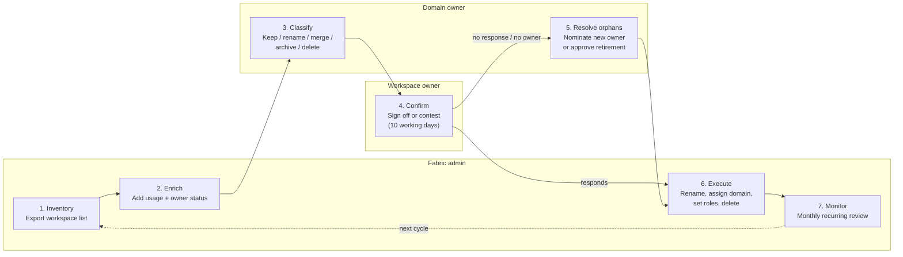
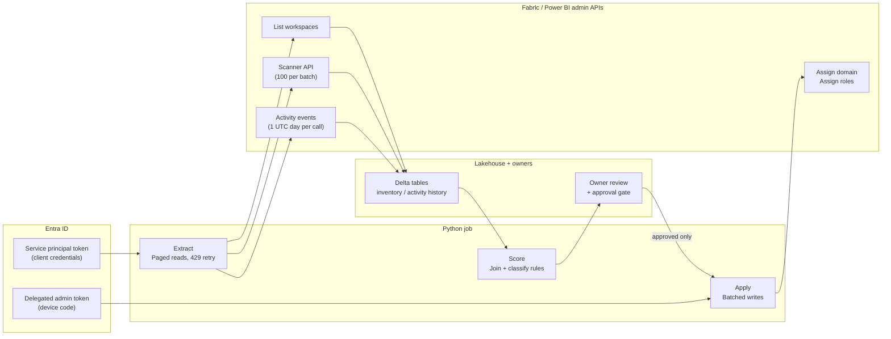

# Workspace cleanup guide — Power BI / Microsoft Fabric

**Scope:** classification and cleanup of ~4,000 existing workspaces in the client tenant
**Stage:** Task 1, step 2 (follows the future-state architecture: domains, archetypes, naming, roles)
**Status:** draft for review

---

## 0. Executive summary

The portal path and the API path are **not two ways to do the same job**. At 4,000 workspaces:

| | Fabric admin portal | Admin REST API + Python |
|---|---|---|
| Build the inventory | Not viable — no "last used" column, manual paging | The only realistic option |
| Business classification | **This is where it belongs** | Cannot be automated |
| Owner outreach / sign-off | **This is where it belongs** | Cannot be automated |
| Apply changes in bulk | Viable for ≤100 workspaces | The only realistic option |
| Exceptions and edge cases | **This is where it belongs** | Fights you |

**Design them as one process with two execution surfaces.** The API produces evidence; humans make decisions; the API applies them.

### Three findings that change the project plan

1. **The activity log only retains ~28–30 days.** You cannot retroactively prove a workspace was unused last year. The project needs a 60–90 day observation window before the first deletion, or a switch to the Microsoft 365 unified audit log (90 days standard / 1 year with Audit Premium).
2. **Domain assignment APIs reject service principals.** They require a signed-in user with the Fabric administrator role. The read pipeline can be unattended; the apply step cannot.
3. **Raise the workspace retention period to 90 days before deleting anything.** Default is 7 days. This is the single cheapest risk control in the project.

---

## 1. Manual process — Fabric admin portal

### 1.1 Swimlane



### 1.2 Step detail

| # | Owner | Action | Where |
|---|---|---|---|
| 1 | Fabric admin | Export the full workspace list | Admin portal → Workspaces → **Export** |
| 2 | Fabric admin | Add last-activity and owner-status columns | Activity log (PowerShell/API) + Entra ID user list |
| 3 | Domain owner | Classify each workspace against a fixed decision set | Shared spreadsheet, one tab per subarea |
| 4 | Workspace owner | Confirm or contest, with a hard deadline | Email from domain owner |
| 5 | Domain owner | Handle orphans (no living admin) | Escalation list |
| 6 | Fabric admin | Apply: rename → assign domain → set roles → delete | Admin portal + domain pages |
| 7 | Fabric admin | Recurring monitoring so the backlog never rebuilds | Admin portal + monthly report |

### 1.3 Notes per step

**Step 1 — Inventory.** The Workspaces page gives name, type, state, capacity and domain, with an Export button. The ribbon and the `...` menu on each workspace carry the management actions; Refresh and Export are always present, the rest depend on workspace type and status. This export is your baseline — snapshot it and version it before anything changes.

**Step 2 — Enrich.** The portal export has no "last used" column. This is the gap that forces the API path even for an otherwise-manual process. Minimum columns to add:

- `lastActivityDate` — from the activity log
- `eventCount30d`, `distinctUsers30d`
- `adminCount`, `adminsActiveInEntra` — orphan detection
- `itemCount` — an empty workspace is an easy delete

**Step 3 — Classify.** This is a business decision, not an admin one. Give each domain owner only their slice, with a **closed** decision set:

| Decision | Meaning |
|---|---|
| `keep` | Stays as-is, gets a domain and roles |
| `keep-rename` | Stays, renamed to the new convention |
| `merge` | Content moves into another workspace, this one is deleted |
| `archive` | Content exported, workspace deleted |
| `delete` | Deleted outright, nothing worth keeping |

Do not offer a free-text option. Ambiguity here is what turns a 3-month project into a 12-month one.

**Step 4 — Confirm.** Give a deadline and state the default. "No response by *date* means this workspace is archived" is the only mechanism that produces responses at this scale.

**Step 5 — Orphans.** When a user is removed from Entra ID, their My workspaces appear as **Deleted** in the State column on the Workspaces page. You can restore those as collaborative workspaces — during restoration you assign at least one workspace admin and give the workspace a new name. For collaborative workspaces whose only admin has left, there is no one to ask: these route to the domain owner as a batch.

**Step 6 — Execute.** Order matters — rename first, then assign the domain, then set roles, then delete. Domain assignment happens from the domain's page via **Assign workspaces**; the side pane lets you assign by name pattern, by capacity, or by workspace admin. The name-pattern option maps directly onto the naming regex in the architecture document, so **do the renaming first and the domain assignment becomes nearly free**.

**Step 7 — Monitor.** Cleanup without monitoring rebuilds the backlog in 18 months. See §5.

### 1.4 Safety net

Deleted collaborative workspaces enter a retention period during which a Fabric admin can restore them — **seven days by default, configurable from 7 to 90 days** via the *Define workspace retention period* tenant setting (Admin portal → Workspace settings). Personal workspaces are fixed at 30 days.

> **Do this before step 6, not after.** Set it to 90.

### 1.5 Reference URLs

| Topic | URL |
|---|---|
| Workspaces page in admin portal | https://learn.microsoft.com/en-us/fabric/admin/portal-workspaces |
| Retention and recovery | https://learn.microsoft.com/en-us/fabric/admin/retention-recovery |
| Set up and manage workspace retention | https://learn.microsoft.com/en-us/fabric/admin/workspace-retention |
| Domains — roles and assignment | https://learn.microsoft.com/en-us/fabric/governance/domains |
| Fabric admin roles | https://learn.microsoft.com/en-us/fabric/admin/roles |
| Access the Power BI activity log | https://learn.microsoft.com/en-us/power-bi/guidance/admin-activity-log |
| Track user activities in Power BI | https://learn.microsoft.com/en-us/fabric/enterprise/powerbi/service-admin-auditing |
| Admin portal overview | https://learn.microsoft.com/en-us/fabric/admin/admin-center |

---

## 2. Automated process — REST API + Python

### 2.1 Swimlane



### 2.2 Phase detail

| Phase | Identity | Schedule | Output |
|---|---|---|---|
| Extract | Service principal | Daily, unattended | Raw JSON → Delta |
| Score | — | Daily | `disposition` recommendation per workspace |
| Review | Human | Per campaign | Approved action list |
| Apply | **Delegated user** | Supervised batch | Domain + role assignments |

### 2.3 The four constraints that shape the code

**1. Don't loop per workspace.**
Per-workspace endpoints are capped at **200 requests per hour** per principal. 4,000 workspaces = 20 hours. Use the **scanner API** instead: it returns workspaces, items, owners, users and lineage in batches of **100 workspace IDs per call**, capped at 500 requests/hour with a maximum of **16 simultaneous scans**. Forty batches, one afternoon.

Scanner cycle:
```
POST /admin/workspaces/getInfo          → scanId
GET  /admin/workspaces/scanStatus/{id}  → poll until "Succeeded" (30–60s interval)
GET  /admin/workspaces/scanResult/{id}  → payload
```

**2. The activity log window is ~28 days.**
Start and end must be in the same UTC day, within the last 28 days. Retention is 30 days. Consequences:

- You **cannot** answer "which workspaces were unused in 2025" today.
- Options: (a) start collecting now into a Delta table and let 60–90 days accumulate, or (b) pull from the M365 unified audit log — 90 days standard, up to 1 year with Audit Premium (E5).
- **This sets the floor on the project timeline. Raise it with the client in week one.**

**3. Domain assignment rejects service principals.**
For `assignWorkspaces`, `assignWorkspacesByPrincipals`, `assignWorkspacesByCapacities` and `roleAssignments/bulkAssign`:

| Identity | Supported |
|---|---|
| User | Yes |
| Service principal | **No** |
| Managed identity | **No** |

The caller must be a Fabric administrator. So the read/score pipeline is unattended, but the apply step needs a device-code token from a signed-in admin — or the portal. Design the handoff deliberately rather than discovering it in testing.

**4. Write rate limit is 10 requests per minute.**
Batch 100 workspace IDs per call and sleep ~7 seconds between batches. Pre-existing domain assignments are **overwritten** unless bulk reassignment is blocked by tenant settings — snapshot the `domainId` column first so the change is reversible.

### 2.4 Two API families

They are not interchangeable:

| Base URL | Covers |
|---|---|
| `https://api.fabric.microsoft.com/v1/admin/...` | Workspaces, workspace users, items, domains, tags, capacities |
| `https://api.powerbi.com/v1.0/myorg/admin/...` | Activity events, scanner / metadata (`workspaces/modified`, `getInfo`, `scanStatus`, `scanResult`) |
| `https://graph.microsoft.com/v1.0/users` | Entra ID user status — separate consent, not covered by the Fabric setup |

Scopes differ too: `https://api.fabric.microsoft.com/.default` vs `https://analysis.windows.net/powerbi/api/.default`. Acquire both tokens.

### 2.5 Rate limits at a glance

| Endpoint | Limit |
|---|---|
| `/admin/workspaces` | 200 / hour |
| `/admin/workspaces/{id}/users` | 200 / hour |
| `/admin/items/{id}/users` | 200 / hour |
| `/admin/activityevents` | 200 / hour, 1 UTC day per call |
| `/admin/workspaces/getInfo` | 500 / hour, 16 concurrent, 100 IDs per call |
| `/admin/domains/{id}/assignWorkspaces` | 10 / minute |
| `/admin/domains/{id}/roleAssignments/bulkAssign` | 25 / minute |
| `/admin/domains/{id}/workspaces` | 25 / minute |

Pagination: the workspaces endpoint returns up to 10,000 records per request with a `continuationToken` for the next page. Write the loop even though 4,000 fits in one page — personal workspaces inflate the count fast.

### 2.6 Reference URLs

| Topic | URL |
|---|---|
| Fabric admin API index | https://learn.microsoft.com/en-us/rest/api/fabric/admin/ |
| List workspaces (admin) | https://learn.microsoft.com/en-us/rest/api/fabric/admin/workspaces/list-workspaces |
| Get workspace (admin) | https://learn.microsoft.com/en-us/rest/api/fabric/admin/workspaces/get-workspace |
| List workspace access details | https://learn.microsoft.com/en-us/rest/api/fabric/admin/workspaces/list-workspace-access-details |
| List item access details | https://learn.microsoft.com/en-us/rest/api/fabric/admin/items/list-item-access-details |
| Domains API index | https://learn.microsoft.com/en-us/rest/api/fabric/admin/domains |
| Assign domain workspaces by IDs | https://learn.microsoft.com/en-us/rest/api/fabric/admin/domains/assign-domain-workspaces-by-ids |
| Assign domain workspaces by principals | https://learn.microsoft.com/en-us/rest/api/fabric/admin/domains/assign-domain-workspaces-by-principals |
| Role assignments bulk assign | https://learn.microsoft.com/en-us/rest/api/fabric/admin/domains/role-assignments-bulk-assign |
| List domain workspaces | https://learn.microsoft.com/en-us/rest/api/fabric/admin/domains/list-domain-workspaces |
| Get activity events | https://learn.microsoft.com/en-us/rest/api/power-bi/admin/get-activity-events |
| GetModifiedWorkspaces | https://learn.microsoft.com/en-us/rest/api/power-bi/admin/workspace-info-get-modified-workspaces |
| PostWorkspaceInfo | https://learn.microsoft.com/en-us/rest/api/power-bi/admin/workspace-info-post-workspace-info |
| Metadata scanning overview | https://learn.microsoft.com/en-us/power-bi/enterprise/service-admin-metadata-scanning |
| Running a metadata scan | https://learn.microsoft.com/en-us/fabric/governance/metadata-scanning-run |
| semantic-link-labs (Python wrappers) | https://semantic-link-labs.readthedocs.io/en/stable/sempy_labs.admin.html |
| MSAL for Python | https://learn.microsoft.com/en-us/entra/msal/python/ |

---

## 3. Requirements — licenses and permissions

### 3.1 Licensing

Licensing is the easy part. **Metadata scanning requires no special license**, and the admin APIs do not require Fabric capacity (F SKU) or Premium.

| Item | Requirement |
|---|---|
| Fabric license on the admin account | Fabric **Free** is sufficient to access the admin portal |
| Fabric capacity (F SKU) | **Not required** for admin APIs |
| Power BI Pro | Not required for the API work itself |
| Audit Premium / E5 | **Only** if you need >30 days of activity history from the unified audit log |

### 3.2 Roles

| Role | Assigned where | Needed for |
|---|---|---|
| **Fabric administrator** | Microsoft 365 admin center | Admin portal, all admin APIs, domain writes |
| Power Platform administrator | Microsoft 365 admin center | Equivalent to the above |
| Global administrator | Microsoft 365 admin center | Superset — avoid |
| Domain admin | Fabric admin portal → Domains | Delegated per-domain management |
| Domain contributor | Fabric admin portal → Domains | Workspace admins who can self-assign to a domain |

> Prefer **Fabric administrator** over Global administrator. Assigning users to dedicated Fabric admin roles grants the permissions needed to administer Fabric without granting full Microsoft 365 admin rights. This will matter in the client's security review.

### 3.3 Service principal setup (read pipeline)

1. **Create an Entra app registration.** Note the client ID.
   ⚠️ The app must have **no admin-consent-required Power BI/Fabric permissions** set on it in the Azure portal. If it does, SPN auth silently fails.
2. **Create a dedicated Entra security group** (type: Security) and add the app as a member.
   Microsoft's own guidance: set up a **dedicated** service principal for Fabric admin APIs — isolated access, clear audit trail, less over-permission.
3. **Enable the tenant setting.** Fabric admin portal → Tenant settings → **Admin API settings** → *Service principals can access read-only admin APIs* → Enabled → **Specific security groups** → add the group → Apply.
4. **Scopes:** `Tenant.Read.All` for reads, `Tenant.ReadWrite.All` where writes are needed.
5. Wait ~15 minutes for the setting to propagate before testing.

### 3.4 Optional tenant settings

| Setting | Effect | Caution |
|---|---|---|
| *Enhance admin APIs responses with detailed metadata* | Scanner returns tables, columns, measures | Requires the read-only SPN setting on |
| *Enhance admin APIs responses with DAX and mashup expressions* | Scanner returns DAX and M code | **Flag to the security team** — exposes all query logic tenant-wide to whoever holds the SPN secret |
| *Service principals can access admin APIs used for updates* | Enables SPN writes | Does **not** unlock the domain endpoints — those remain user-only |

### 3.5 Beyond Fabric

| Requirement | Why |
|---|---|
| Microsoft Graph `User.Read.All` (application permission, admin consent) | Match workspace admins against Entra ID to find orphans. **Not** covered by the Fabric admin API setup |
| Azure Key Vault | Client secret storage. Never in the notebook, never in the repo |
| Exchange Online PowerShell / Purview access | Only if pulling >30 days from the unified audit log |

### 3.6 Reference URLs

| Topic | URL |
|---|---|
| Enable service principal auth for admin APIs | https://learn.microsoft.com/en-us/fabric/admin/enable-service-principal-admin-apis |
| Admin API tenant settings | https://learn.microsoft.com/en-us/fabric/admin/service-admin-portal-admin-api-settings |
| Set up metadata scanning | https://learn.microsoft.com/en-us/fabric/governance/metadata-scanning-setup |
| Fabric admin roles | https://learn.microsoft.com/en-us/fabric/admin/roles |
| What is Fabric admin | https://learn.microsoft.com/en-us/fabric/admin/microsoft-fabric-admin |

---

## 4. Python function library

Full annotated module: **`fabric_workspace_cleanup.py`** — each function documents the endpoint it wraps and the limit that bites.

### 4.1 Function map

| Group | Function | Purpose | Identity |
|---|---|---|---|
| **Auth** | `get_app_token()` | Client-credentials token for reads | SPN |
| | `get_delegated_token()` | Device-code token for domain writes | User |
| **Plumbing** | `api_get()` | GET with 429 retry honouring `Retry-After` | — |
| | `api_post()` | POST returning raw response (for LRO headers) | — |
| | `paged_get()` | Follows `continuationToken` to the end | — |
| **Inventory** | `list_workspaces()` | Full tenant census → DataFrame | SPN |
| | `get_workspace_users()` | Roles per workspace (Admin/Member/Contributor/Viewer) | SPN |
| **Bulk metadata** | `get_modified_workspaces()` | All IDs, or only those changed since a date | SPN |
| | `scan_workspaces()` | One scanner cycle, ≤100 workspaces | SPN |
| | `scan_all()` | Batches the whole tenant sequentially | SPN |
| **Activity** | `get_activity_events()` | One UTC day of audit events | SPN |
| | `build_activity_history()` | Loops the full 28-day window | SPN |
| | `get_last_activity_per_workspace()` | Reduces events to last-seen + counts | — |
| **Users** | `list_entra_users()` | Directory status via Graph | SPN (Graph) |
| | `find_orphaned_workspaces()` | Workspaces with no living admin | — |
| **Classify** | `classify_workspaces()` | Rules → disposition recommendation | — |
| **Domains** | `list_domains()` | Existing domain tree | SPN |
| | `create_domain()` | Build domains/subdomains from the architecture | User |
| | `assign_workspaces_to_domain()` | Batched assignment, 7s sleep | **User** |
| | `assign_domain_admins()` | Bulk domain admins/contributors from the RACI | **User** |

### 4.2 Key function notes

**`list_workspaces()`** — the backbone. A single call already tells you which workspaces have no domain (`domainId` null) and which sit on no capacity. Filter `type="PersonalGroup"` to isolate My Workspaces, which are usually a large share of a 4,000-workspace tenant and need a different disposition rule entirely.

**`get_workspace_users()`** — 200 calls/hour. Use it for flagged candidates only. For the full tenant, get the same data from the scanner with `getArtifactUsers=true`.

**`find_orphaned_workspaces()`** — the single highest-value query in the project. A workspace with no living admin has nobody who can consent to changes, nobody to ask "do you still need this", and nobody accountable for what it exposes. These are your fastest wins and your biggest risk.

**`classify_workspaces()`** — deliberately conservative. Nothing is ever marked *delete* automatically; the output is a **recommendation** a domain owner signs off on. The rules encode a governance policy, not a technical fact — tune them **with** the client:

| Condition | Disposition |
|---|---|
| `state != Active` | `already-deleted` |
| `type == PersonalGroup` | `personal-review` |
| No activity **and** orphaned | `candidate-retire` |
| No activity | `candidate-archive` |
| Orphaned but active | `needs-new-owner` |
| Active, no domain | `keep-assign-domain` |
| Otherwise | `keep` |

**`assign_workspaces_to_domain()`** — requires a user token. Overwrites existing assignments. Snapshot `domainId` first.

### 4.3 The shortcut worth knowing

Microsoft's **`semantic-link-labs`** library already wraps most of these:

```python
%pip install semantic-link-labs
import sempy_labs as labs

labs.admin.list_workspaces()
labs.admin.list_workspace_access_details(workspace=...)
labs.admin.list_activity_events(start_time=..., end_time=...)
labs.admin.scan_workspaces(workspace=batch)
labs.admin.assign_domain_workspaces(domain_name=..., workspace_names=[...])
```

Run inside a Fabric notebook it handles authentication for you — no MSAL, no token plumbing.

**Recommendation:** deliver the raw `requests` version as the documented artefact (it shows the client exactly what is being called and runs anywhere), and use `semantic-link-labs` for the actual execution if the client hosts this in Fabric.

---

## 5. Recurring operation (post-cleanup)

Cleanup without monitoring rebuilds the backlog in ~18 months. Minimum standing controls:

| Control | Frequency | Mechanism |
|---|---|---|
| Activity capture → Delta table | Daily | Scheduled notebook, `build_activity_history()` |
| Inventory refresh | Daily | `get_modified_workspaces(modifiedSince=...)` incremental scan |
| Naming-convention violations | Weekly | Regex check against `list_workspaces()` |
| Workspaces with no domain | Weekly | `domainId is null` |
| Orphaned workspaces | Weekly | Graph join |
| Stale workspaces (>90d no activity) | Monthly | Report to domain owners |
| Restrict workspace creation | Standing | Tenant setting → specific security groups |

The last row is the one that actually prevents recurrence. Everything else detects.

---

## 6. Open questions for the client

- [ ] Current workspace retention setting — 7 days or already raised?
- [ ] Is Audit Premium / E5 available? Determines whether the observation window is 30 or 90+ days.
- [ ] Who signs off on deletion — domain owner, IT, or both?
- [ ] How many of the ~4,000 are personal workspaces (`PersonalGroup`)? Changes the scope materially.
- [ ] Is there an existing SPN and security group, or does this need to be created?
- [ ] Will the automation be hosted in Fabric (notebook) or externally (Azure Functions / ADF)?
- [ ] Is the *DAX and mashup expressions* tenant setting acceptable to the security team?

---

## 7. Change log

| Date | Version | Change |
|---|---|---|
| 2026-08-02 | 0.1 | Initial draft — portal workflow, API automation, requirements, function library |
